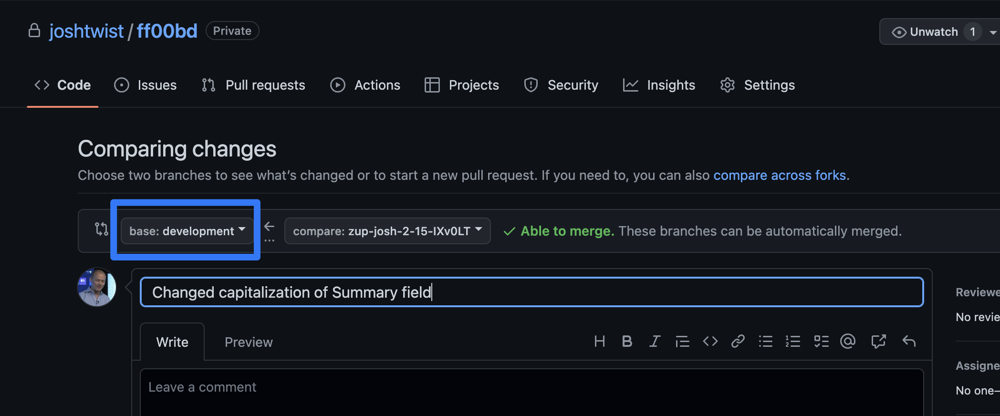
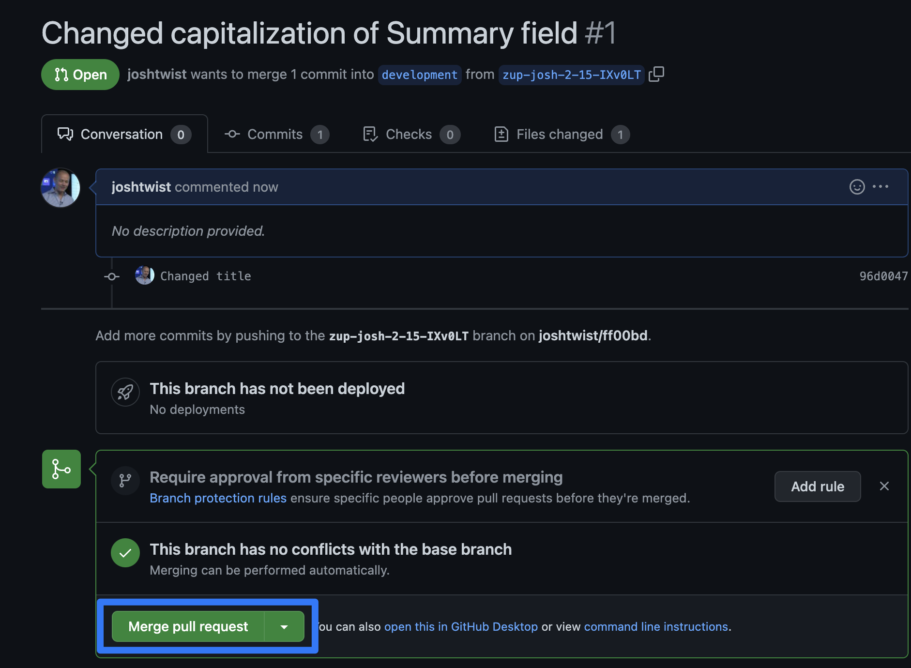

<QuickstartPicker
  mode="local"
  alternateLink="/articles/step-4-deploying-to-the-edge"
/>

In this guide we'll show you how to deploy your gateway to the edge, at over 300
data-centers around the world. The act of deployment creates new
[environments](./environments) and it's worth familiarizing yourself with
[how environments work](./environments).

In this tutorial we'll show the default workflow via GitHub, but note that we
also support GitLab, BitBucket
([enterprise plan only](https://zuplo.com/pricing)) and
[custom CI/CD](./custom-ci-cd).

To follow this tutorial you'll need

- a GitHub account (it's free, sign up at [github.com](https://github.com)).
- a zuplo project - complete [Step 1](./step-1-setup-basic-gateway.mdx),
  [Step 2](./step-2-add-rate-limiting.mdx) and
  [Step 3](./step-3-add-api-key-auth.mdx) for a great start!
- to install the
  [Zuplo GitHub deployment](https://github.com/apps/zuplo/installations/new) to
  GitHub - you can
  [follow these instructions](https://github.com/apps/zuplo/installations/new)

Let's get started:

<Stepper>

1. Authorize to GitHub

   Next, go to your project in the Zuplo portal and open to the **Settings**
   tab, then select **Source Control**. Control. If your project isn't already
   connected to GitHub click the **Connect to GitHub** button and follow the
   auth flow. You'll need to grant permissions for any GitHub organizations you
   want to work with.

   

   Next, a dialog will open asking you to authorize Zuplo. Click the **Authorize
   Zuplo** button.

   <Framed size="sm">

   

   </Framed>

   <Callout type="tip" title="GitHub Permissions" >

   The permission "Act on your behalf" sounds a bit scary - however, this is a
   standard GitHub permission and by default Zuplo can't actually do anything
   with this. In order to perform actions on your behalf you must grant Zuplo
   access to a specific repository (shown in the next steps.).

   [read more about this permission on GitHub's docs](https://docs.github.com/en/apps/using-github-apps/authorizing-github-apps#about-github-apps-acting-on-your-behalf).

   </Callout>

   After you have connected the GitHub app, it needs to be granted permission to
   edit a repository. If this is your first time connecting Zuplo, you will be
   immediately asked to select a GitHub Org to install Zuplo. Select the org you
   want to use.

   <Framed size="sm">

   

   </Framed>

   Next, you will be asked to select the repositories that you want Zuplo to
   access. The easiest thing is to just select **All Repositories**, but if you
   want fine-grain control, you can select a specific repository.

   <Framed size="sm">

   

   </Framed>

   <Callout type="caution" title="Existing Installation" >

   The next step is only if you already have Zuplo installed in a GitHub org and
   need to add another organization.

   </Callout>

   If you weren't prompted to select a GitHub org, it's likely that you are
   already a member of an account that has authorized Zuplo. To add Zuplo to a
   new organization click **Add GitHub Account** in the org picker list.

   

1. Connect GitHub to your Project

   With your GitHub App configured, you can now return to the Zuplo portal. In
   the **Source Control** settings you should now see a list of GitHub
   repositories. Create a new repository by clicking the **Create new
   repository** button. You will be prompted that this will open GitHub. Click
   to continue.

   

   In the GitHub UI, you can rename your repository if you want. Click the
   **Create repository** button at the bottom of the page and return to the
   Zuplo Portal.

   The portal will reload and you will see your new repository listed. Click
   **Connect** to connect Zuplo to that repository.

   

   After the connection succeeds you will see a link to your GitHub repository.

   

   Click the link to return to GitHub. You should see a little brown dot next to
   the commit hash (1). When you hover your mouse over that you'll see the Zuplo
   deployment was successful. Click **Details** (2) to open the deployment info.

   This shows that your deployment is in progress, it will take about 50
   seconds.

   

   On the deployment page, you will see **Deployment has Completed!!** and below
   that's the link to your new environment.

   

1. Deploy another Environment

   Zuplo makes it easy for teams to collaborate by allowing teams to create many
   preview environments. To create a new environment, simple go to your
   repository in GitHub and create a new branch.

   Let's create a branch called `development`

   

   Wait about 20s and head back to Zuplo - you should see a new entry in the
   environment dropdown called `development`.

1. Push a Change to 'development'

   Let's make a simple change to our `working-copy` environment. Let's do
   something simple like capitalize the **Summary** field from 'Get all todos'
   to 'Get All Todos'. It doesn't really matter what the change is.

   

   Save your changes. Click the GitHub button at bottom left and choose **Commit
   & Push**.

   

   Enter a description of your change in the dialog that pops up:

   <ModalScreenshot>

   

   </ModalScreenshot>

   Click **Commit & Push** will create a new temporary branch in GitHub with a
   name `zup-...`. On the next dialog, click **Create Pull Request**.

   <ModalScreenshot>

   

   </ModalScreenshot>

   This will navigate you to the screen in GitHub that allows you to create a
   Pull Request. Change the **base** branch to `development` (since that's the
   environment we want to update first). Click **Create pull request**.

   

   When ready, click **Merge pull request**.

   

   Once merged, you'll want to delete that temporary branch.

   

   The successful merge will trigger a rebuild and deployment of `development`
   with your change. You can check this by choosing the environment
   `development` in Zuplo and navigating to the **read only** Route Designer.

   

   This shows how you can use widely recognized GitOps practices to manage how
   code flows through your environments using Pull Requests and protected
   branches.

</Stepper>

## Troubleshooting

I don't see my repository listed in Zuplo project settings.

- Make sure you've granted access to the project with the Zuplo GitHub App, you
  can
  [check that configuration here](https://github.com/apps/zuplo/installations/new)

I've connected my Zuplo project to a GitHub repository but get access errors
when running commits, pulls or try to open a pull request.

- If you are the owner of the project, make sure you've granted access to the
  project with the Zuplo GitHub App, you can
  [check that configuration here](https://github.com/apps/zuplo/installations/new)
- If this Zuplo project was shared with you, make sure you are a GitHub
  collaborator. This can be verified by going to the GitHub repository >
  Settings > Collaborators section. You'll need admin permissions to the
  repository.
- If the GitHub repository has been renamed or moved to a different
  organization, try disconnecting and reconnecting to it. You can do this by
  going to your Zuplo project's settings > Source Control section
