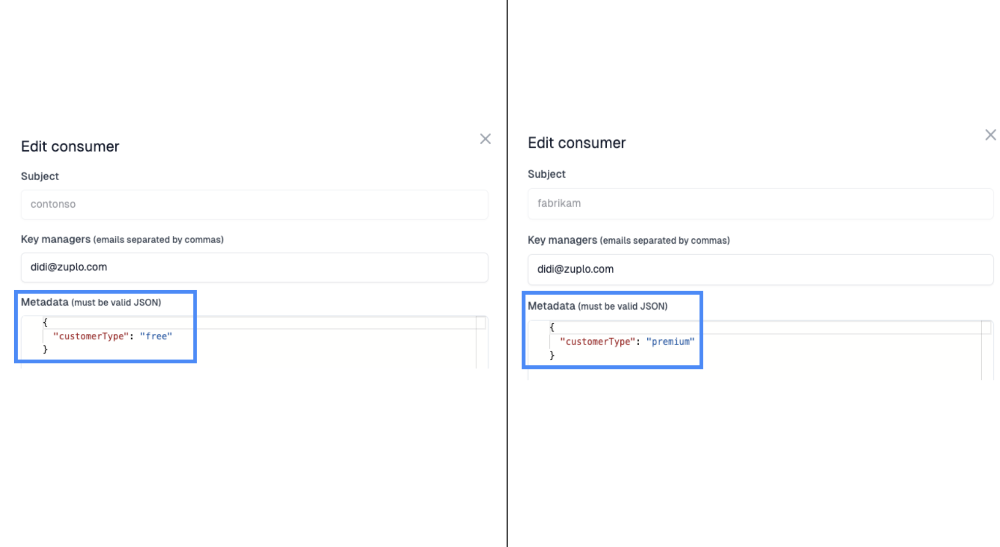
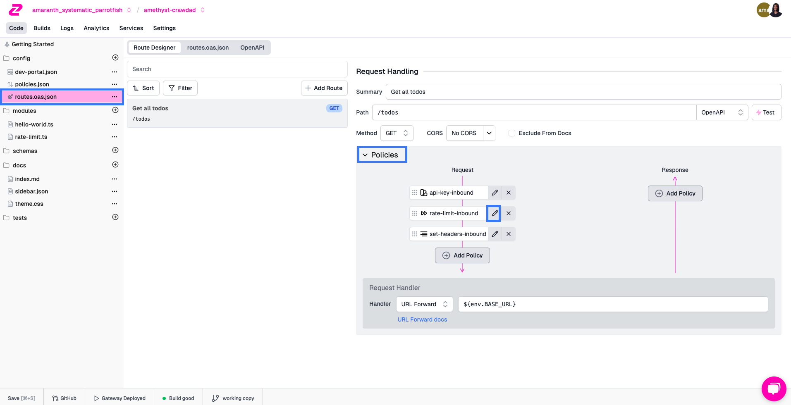

Fortune favors the bold. In this bonus getting started guide - we'll show you
how to add dynamic rate limiting to your API.

To follow this tutorial you'll need to have completed
[Step 1](./step-1-setup-basic-gateway.mdx) for a Zuplo project,
[Step 2](./step-2-add-rate-limiting.mdx) to add rate limiting to that route, and
[Step 3](./step-3-add-api-key-auth.mdx) to add API key authentication to that
same route.

:::info{title="What is Dynamic Rate Limiting?"}

Traditionally, rate limits are static and the same for everyone. This approach
doesn't let you tailor your rate limiting to your API user - you might want to
offer higher rate limits for customers that pay more. Dynamic rate limiting
allows you to determine an appropriate rate limit at request time.

:::

Let's get started.

<Stepper>

1. Add Consumer Metadata

   Let's make our rate-limiting policy more dynamic, based on properties of the
   customer. [Create a new consumer](./step-3-add-api-key-auth.mdx) (Services ->
   API Key Service -> Configure -> Create Consumer), and in the Metadata field,
   set the following:

   ```json
   {
     "customerType": "free"
   }
   ```

   Update the metadata of your other API Key consumer (3-dot menu -> Edit) from
   Step 3 to

   ```json
   {
     "customerType": "premium"
   }
   ```

   

   Now that we've users with different `customerType`, we can utilize this
   information to rate limit them differently.

1. Add a Custom Code Module

   Navigate back to the Code tab. Now add a new module to the files section by
   clicking the `+` next to the **modules** folder and choose new empty module.
   Name the module `rate-limit.ts`.

   

   :::info{title="What's a Module?"}

   Modules are Typescript functions that you can execute within Zuplo. They're
   typically used to add custom code within the request/response pipeline (ex.
   custom policies or request handlers). You can even perform network requests
   and use libraries within these modules.

   :::

   Add the following code to your module.

   ```ts
   import { ZuploContext, ZuploRequest } from "@zuplo/runtime";

   export function rateLimit(request: ZuploRequest, context: ZuploContext) {
     const user = request.user;

     // premium customers get 1000 requests per mintue
     if (user.data.customerType === "premium") {
       return {
         key: user.sub,
         requestsAllowed: 1000,
         timeWindowMinutes: 1,
       };
     }

     // free customers get 5 requests per minute
     if (user.data.customerType === "free") {
       return {
         key: user.sub,
         requestsAllowed: 5,
         timeWindowMinutes: 1,
       };
     }

     // everybody else gets 30 requests per minute
     return {
       key: user.sub,
       requestsAllowed: 30,
       timeWindowMinutes: 1,
     };
   }
   ```

1. Update your Policy

   Now we'll reconfigure the rate-limiting policy to wire up our custom
   function. Find the policy in the **Route Designer** and click **Edit**.

   

   Update the configuration to

   ```json
   {
     "export": "RateLimitInboundPolicy",
     "module": "$import(@zuplo/runtime)",
     "options": {
       "rateLimitBy": "function",
       "requestsAllowed": 2,
       "timeWindowMinutes": 1,
       "identifier": {
         "export": "rateLimit",
         "module": "$import(./modules/rate-limit)"
       }
     }
   }
   ```

   By changing the `rateLimitBy` to `function` you are indicating the rate limit
   will be determined by a module at runtime. The `identifier` property is used
   to indicate the module and function to run. Make sure to save once you've
   made your changes.

   ## 4/ Test your Policy

   Using the Test modal, you can try your dynamic rate limiting. You can grab
   the key for each consumer back in the Services tab where you created them.
   Like [Step 3](./step-3-add-api-key-auth.mdx), you can fill in the keys into
   the `Authorization` header and start making calls until you hit your rate
   limit. Try out the other key and observe the difference in rate limits.

</Stepper>

## Wrapping up

Congratulations - you've just successfully built an API that's:

- Protected by API key Authentication
- Dynamically Rate Limited
- Deployed to the Edge for superior performance
- and fully documented via your Developer Portal

This is an API experience most companies dream of, and you've just built it in
less than an hour.

### Next Steps

- Continue exploring our docs to learn about customizing your
  [Developer Portal](../dev-portal/introduction.md), or explore our various
  [Integrations](https://zuplo.com/integrations)
- [Grab time](https://zuplo.com/meeting) with the Zuplo team to have your
  questions answered
- Start generating revenue from your new API with our
  [Monetization tutorial](./monetization.md)
