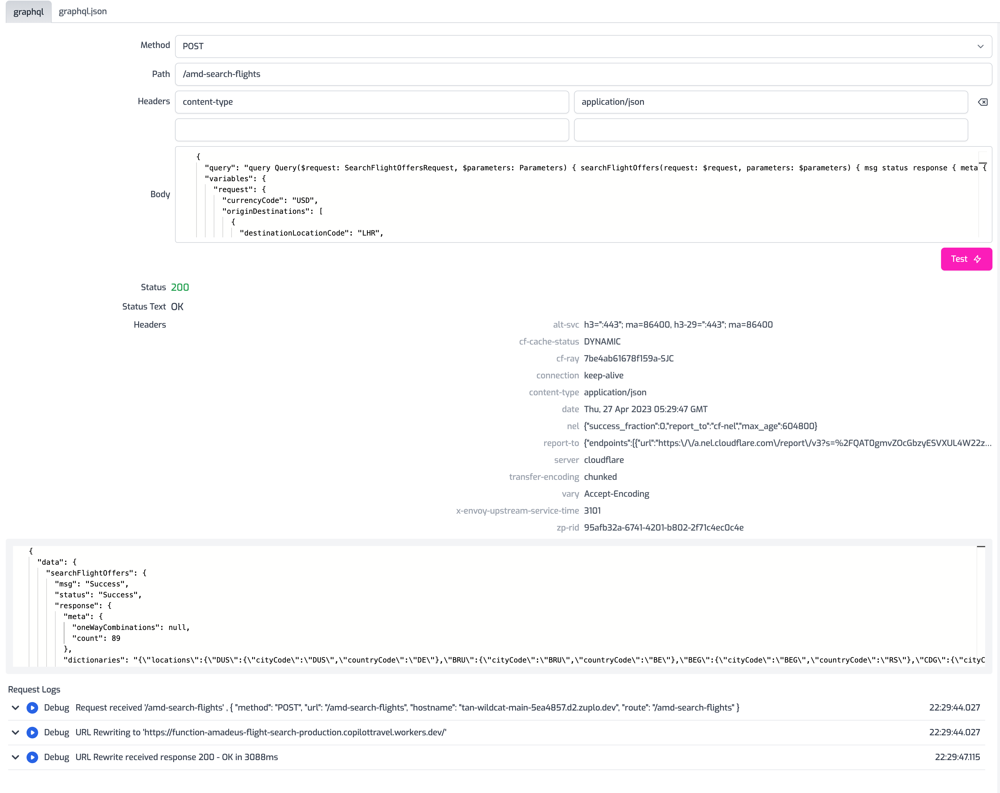

If you write a route that proxies a GraphQL API, you can test your route using
the following methods:

## 1/ Using the Zuplo Portal

The fastest way to test your GraphQL endpoint using the Zuplo Portal is via the
API Test Console.

1. Navigate to the API test console tab and create a new "Code Test"
2. Fill in the method, path, and headers you need. Leave the `content-type` as
   `application/json`
3. Convert your GraphQL Query and GraphQL Variables into a JSON body. You can
   use [this tool](https://datafetcher.com/graphql-json-body-converter) to do so
   easily
4. Paste the JSON Body into the test's Body field and click the **Test** button

## 2/ Using a Third-Party Request Tool

Various third-party tools have tighter integrations to make GraphQL requests.
You can check out this
[article from Postman](https://learning.postman.com/docs/sending-requests/graphql/graphql/#using-json-in-the-request-body).
