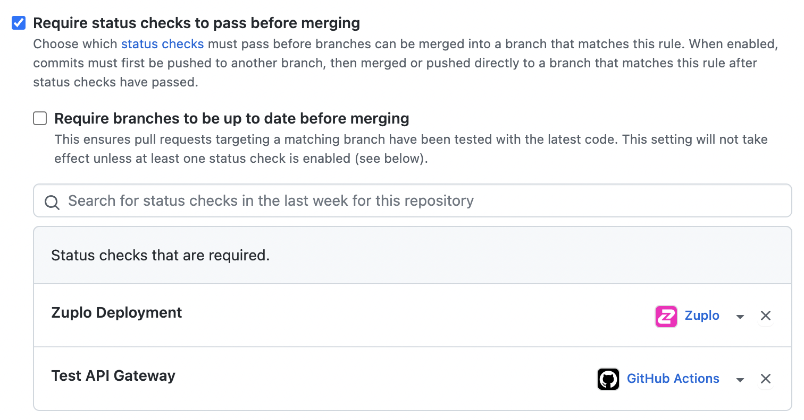

Zuplo provides multiple ways to test your API gateway at every stage of
development. Whether you are iterating locally, reviewing a pull request in a
preview environment, or gating production deployments in CI/CD, the
[`zuplo test`](../cli/test.mdx) command and the `@zuplo/test` library give you a
consistent testing experience.

## Testing strategies overview

| Strategy                                       | When to use                                                        | Endpoint target                      |
| ---------------------------------------------- | ------------------------------------------------------------------ | ------------------------------------ |
| [Local testing](#local-testing)                | Fast feedback while developing                                     | `http://localhost:9000`              |
| [Preview environments](#preview-environments)  | Validate changes on a real deployment before merging               | `https://<branch>-<id>.zuplo.app`    |
| [CI/CD integration](#cicd-integration-testing) | Automated gate that blocks broken changes from reaching production | Deployment URL from your CI provider |

All three strategies use the same test files and the same `zuplo test` command.
The only thing that changes is the `--endpoint` value.

## Local testing

Running tests against a local development server gives the fastest feedback
loop. Start the server with [`zuplo dev`](../cli/dev.mdx), then run your test
suite against it.

### Starting the local server

```bash
npx zuplo dev
```

The API gateway starts on `http://localhost:9000` by default. You can change the
port with the `--port` flag. See the [`zuplo dev` reference](../cli/dev.mdx) for
all available options.

### Running tests locally

With the dev server running, open a second terminal and run:

```bash
npx zuplo test --endpoint http://localhost:9000
```

The command discovers every `*.test.ts` file under the `tests/` folder and
executes them against the provided endpoint.

:::tip

You can filter which tests run with the `--filter` flag. For example,
`npx zuplo test --endpoint http://localhost:9000 --filter 'auth'` runs only
tests whose name contains "auth".

:::

### Testing with Zuplo services locally

Some features, such as API key authentication and rate limiting, require a
connection to Zuplo cloud services. To use these features in local development,
link your local project to an existing Zuplo project with
[`zuplo link`](../cli/link.mdx):

```bash
npx zuplo link
```

Follow the prompts to select your account, project, and environment. This
creates a `.env.zuplo` file that the dev server reads automatically. For local
development, selecting the **development** environment is recommended.

:::warning

The `.env.zuplo` file can contain sensitive information. Add it to your
`.gitignore` file so it is not committed to source control.

:::

Once linked, services like the API Key Authentication policy work locally using
the same API key bucket as the linked environment. You can create API key
consumers in the [Zuplo Portal](https://portal.zuplo.com) under **Services > API
Key Service**, then call your local gateway with the generated key:

```bash
curl http://localhost:9000/your-route \
  -H "Authorization: Bearer YOUR_API_KEY"
```

For more details see
[Connecting to Zuplo Services Locally](./local-development-services.mdx).

### Setting environment variables locally

Your local dev server does not have access to the environment variables
configured in the Zuplo Portal. Instead, create a `.env` file in your project
root:

```text title=".env"
MY_BACKEND_URL=https://api.example.com
MY_SECRET=supersecret
```

The Zuplo CLI loads these variables automatically when you run `npx zuplo dev`.
See
[Configuring Environment Variables Locally](./local-development-env-variables.mdx)
for more information.

## Preview environments

Every branch pushed to your connected source control provider can create an
isolated [preview environment](./environments.mdx). Preview environments are
full Zuplo deployments that behave the same as production, making them ideal for
testing pull requests before merging.

### Running tests against a preview environment

Pass the preview environment URL as the endpoint:

```bash
npx zuplo test --endpoint https://your-branch-abc123.zuplo.app
```

Because preview environments run the full Zuplo runtime, including edge
deployment, policies, and connected services, tests that pass here give high
confidence that the changes work in production.

### Combining local and remote testing

For maximum coverage, test locally first for fast iteration, then run the same
test suite against the deployed preview environment:

1. Start local development and run tests against `http://localhost:9000`.
2. Push your branch. Zuplo deploys a preview environment automatically.
3. Run `npx zuplo test --endpoint <preview-url>` to verify behavior on the real
   edge deployment.

## CI/CD integration testing

Automated tests in your CI/CD pipeline ensure that every deployment is validated
before changes reach production. The `zuplo test` command works with any CI
system.

:::tip

The examples below use the Zuplo GitHub integration. If you prefer setting up
your own CI/CD for more fine-grained control, see
[Custom CI/CD](./custom-ci-cd.mdx).

:::

### Testing after deployment with GitHub Actions

Using the Zuplo GitHub integration, tests can run after a deployment and block
pull requests from being merged. The Zuplo Git Integration sets
[Deployments](https://docs.github.com/en/rest/deployments/deployments) and
[Deployment Statuses](https://docs.github.com/en/rest/deployments/statuses) for
any push to a GitHub branch.

Here is a simple GitHub Action that uses the Zuplo CLI to run the tests after
the deployment is successful. Notice how the property
`github.event.deployment_status.environment_url` is set to the `API_URL`
environment variable. This is one way you can pass the URL where the preview
environment is deployed into your tests.

```yaml title="/.github/workflows/main.yaml"
name: Main
on: [deployment_status]

jobs:
  test:
    name: Test API Gateway
    runs-on: ubuntu-latest

    steps:
      - uses: actions/checkout@v4
      - name: Use Node.js
        uses: actions/setup-node@v4
        with:
          node-version-file: ".nvmrc"

      - name: Run Tests
        # Useful properties 'environment', 'state', and 'environment_url'
        run:
          API_URL=${{ toJson(github.event.deployment_status.environment_url) }}
          npx zuplo test --endpoint $API_URL
```

### Requiring status checks

[GitHub Branch protection](https://docs.github.com/en/repositories/configuring-branches-and-merges-in-your-repository/defining-the-mergeability-of-pull-requests/about-protected-branches)
can be set in order to enforce policies on when a Pull Request can be merged.
The example below sets the "Zuplo Deployment" and "Test API Gateway" as required
status that must pass.



When a developer tries to merge their pull request, they will see that the tests
haven't passed and the pull request can't be merged.


### Local testing in CI

You can also run tests against a local Zuplo server inside your CI pipeline
before deploying anywhere. This catches issues earlier and avoids deploying
broken changes.

```yaml title="/.github/workflows/local-test-then-deploy.yaml"
name: Local Test Then Deploy
on:
  push:
    branches:
      - main
  pull_request:

jobs:
  local-test:
    runs-on: ubuntu-latest
    steps:
      - uses: actions/checkout@v4
      - uses: actions/setup-node@v4
        with:
          node-version: 20
      - name: Install dependencies
        run: npm install
      - name: Start local server and run tests
        run: |
          npx zuplo dev &
          DEV_PID=$!
          echo "Waiting for local server to start..."
          sleep 10
          npx zuplo test --endpoint http://localhost:9000
          kill $DEV_PID

  deploy:
    needs: local-test
    runs-on: ubuntu-latest
    if: github.event_name == 'push' && github.ref == 'refs/heads/main'
    env:
      ZUPLO_API_KEY: ${{ secrets.ZUPLO_API_KEY }}
    steps:
      - uses: actions/checkout@v4
      - uses: actions/setup-node@v4
        with:
          node-version: 20
      - name: Install dependencies
        run: npm install
      - name: Deploy to Zuplo
        run: npx zuplo deploy --api-key "$ZUPLO_API_KEY"
```

For CI/CD examples with other providers, see
[Custom GitHub Actions](./custom-ci-cd-github.mdx),
[GitLab CI/CD](./custom-ci-cd-gitlab.mdx), and
[CircleCI](./custom-ci-cd-circleci.mdx).

## Writing tests

Using Node.js 18 and the Zuplo CLI, it's very easy to write tests that make
requests to your API using `fetch` and then validate expectations with `expect`
from [chai](https://www.chaijs.com/api/bdd/).

```js title="/tests/my-test.test.ts"
import { describe, it, TestHelper } from "@zuplo/test";
import { expect } from "chai";

describe("API", () => {
  it("should have a body", async () => {
    const response = await fetch(TestHelper.TEST_URL);
    const result = await response.text();
    expect(result).to.equal(JSON.stringify("What zup?"));
  });
});
```

Check out our
[other sample tests](https://github.com/zuplo/zup-cli-example-project/tree/main/tests)
to find one that matches your use-case.

:::tip

Your test files need to be under the `tests` folder and end with `.test.ts` to
be picked up by the Zuplo CLI.

:::

## Tips for writing tests

This section highlights some of the features of the Zuplo CLI that can help you
write and structure your tests. Check out our
[other sample tests](https://github.com/zuplo/zup-cli-example-project/tree/main/tests)
to find one that matches your use-case.

### Ignoring tests

You can use `.ignore` and `.only` to ignore or run only specific test. The full
example is at
[ignore-only.test.ts](https://github.com/zuplo/zup-cli-example-project/blob/main/tests/ignore-only.test.ts)

```js title="/tests/ignore-only.test.ts"
import { describe, it } from "@zuplo/test";
import { expect } from "chai";

/**
 * This example how to use ignore and only.
 */
describe("Ignore and only test example", () => {
  it.ignore("This is a failing test but it's been ignored", () => {
    expect(1 + 4).to.equals(6);
  });

  //   it.only("This is the only test that would run if it weren't commented out", () => {
  //     expect(1 + 4).to.equals(5);
  //   });
});
```

### Filtering tests

You can use the CLI to filter tests by name or regex. The full example is at
[filter.test.ts](https://github.com/zuplo/zup-cli-example-project/blob/main/tests/filter.test.ts)

```js title="/tests/filter.test.ts"
import { describe, it } from "@zuplo/test";
import { expect } from "chai";

/**
 * This example shows how to filter the test by the name in the describe() function.
 * You can run `zuplo test --filter '#labelA'`
 * If you want to use regex, you can do `zuplo test --filter '/#label[Aa]/'`
 */
describe("[#labelA #labelB] Addition", () => {
  it("should add positive numbers", () => {
    expect(1 + 4).to.equals(5);
  });
});
```

### Using environment variables in tests

You can pass environment variables to your tests by setting them before the
`zuplo test` command. Inside your test files, access them with `process.env`:

```bash
MY_API_KEY=zpka_abc123 npx zuplo test --endpoint http://localhost:9000
```

```ts title="/tests/auth.test.ts"
import { describe, it, TestHelper } from "@zuplo/test";
import { expect } from "chai";

describe("Authentication", () => {
  it("should reject requests without an API key", async () => {
    const response = await fetch(`${TestHelper.TEST_URL}/my-route`);
    expect(response.status).to.equal(401);
  });

  it("should accept requests with a valid API key", async () => {
    const response = await fetch(`${TestHelper.TEST_URL}/my-route`, {
      headers: {
        Authorization: `Bearer ${process.env.MY_API_KEY}`,
      },
    });
    expect(response.status).to.equal(200);
  });
});
```

## Writing integration tests

Integration tests verify that your API gateway behaves correctly end-to-end,
including routing, policies, and backend connectivity. Because `zuplo test` runs
against a live endpoint (local or deployed), every test is inherently an
integration test.

### Testing response status and headers

```ts title="/tests/headers.test.ts"
import { describe, it, TestHelper } from "@zuplo/test";
import { expect } from "chai";

describe("Response headers", () => {
  it("should include CORS headers", async () => {
    const response = await fetch(`${TestHelper.TEST_URL}/my-route`, {
      method: "OPTIONS",
      headers: {
        Origin: "https://example.com",
        "Access-Control-Request-Method": "GET",
      },
    });
    expect(response.headers.get("access-control-allow-origin")).to.exist;
  });

  it("should return JSON content type", async () => {
    const response = await fetch(`${TestHelper.TEST_URL}/my-route`);
    expect(response.headers.get("content-type")).to.include("application/json");
  });
});
```

### Testing rate limiting

```ts title="/tests/rate-limit.test.ts"
import { describe, it, TestHelper } from "@zuplo/test";
import { expect } from "chai";

describe("Rate limiting", () => {
  it("should include rate limit headers", async () => {
    const response = await fetch(`${TestHelper.TEST_URL}/my-route`, {
      headers: {
        Authorization: `Bearer ${process.env.MY_API_KEY}`,
      },
    });
    expect(response.headers.get("ratelimit-limit")).to.exist;
    expect(response.headers.get("ratelimit-remaining")).to.exist;
  });
});
```

### Testing request validation

```ts title="/tests/validation.test.ts"
import { describe, it, TestHelper } from "@zuplo/test";
import { expect } from "chai";

describe("Request validation", () => {
  it("should reject invalid request bodies", async () => {
    const response = await fetch(`${TestHelper.TEST_URL}/my-route`, {
      method: "POST",
      headers: { "Content-Type": "application/json" },
      body: JSON.stringify({ invalid: "data" }),
    });
    expect(response.status).to.equal(400);
  });

  it("should accept valid request bodies", async () => {
    const response = await fetch(`${TestHelper.TEST_URL}/my-route`, {
      method: "POST",
      headers: { "Content-Type": "application/json" },
      body: JSON.stringify({ name: "Test", email: "test@example.com" }),
    });
    expect(response.status).to.equal(200);
  });
});
```

## Unit Tests & Mocking

:::caution{title="Advanced"}

Custom testing can be complicated and is best used only to test your own logic
rather than trying to mock large portions of your API Gateway.

:::

It's usually possible to use test frameworks like
[Mocha](https://github.com/zuplo/zuplo/tree/main/examples/test-mocks) and
mocking tools like [Sinon](https://sinonjs.org/) to unit tests handlers,
policies, or other modules. To see an example of how that works see this sample
on GitHub: https://github.com/zuplo/zuplo/tree/main/examples/test-mocks

Do note though that not everything in the Zuplo runtime can be mocked.
Additionally, internal implementation changes might cause mocking behavior to
change or break without notice. Unlike our public API we don't guarantee that
mocking will remain stable between versions.

Generally speaking, if you must write unit tests, it's best to test your logic
separately from the Zuplo runtime. For example, write modules and functions that
take all the arguments as input and return a result, but don't depend on any
Zuplo runtime code.

For example, if you have a function that uses an environment variable and want
to unit test it.

Don't do this:

```ts
import { environment } from "@zuplo/runtime";

export function myFunction() {
  const myVar = environment.MY_ENV_VAR;
  return `Hello ${myVar}`;
}
```

Instead do this:

```ts
export function myFunction(myVar: string) {
  return `Hello ${myVar}`;
}
```

Then write your test like this:

```ts
import { myFunction } from "./myFunction";

describe("myFunction", () => {
  it("should return Hello World", () => {
    expect(myFunction("World")).to.equal("Hello World");
  });
});
```

### Polyfills

If you are running unit tests in a Node.js environment, you may need to polyfill
some globals. Zuplo itself doesn't run on Node.js, but because Zuplo is built on
standard API, testing in Node.js is possible.

If you are running on Node.js 20 or later, you can use the `webcrypto` module to
polyfill the `crypto` global. You must register this polyfill before any Zuplo
code runs.

```js
import { webcrypto } from "node:crypto";
if (typeof crypto === "undefined") {
  globalThis.crypto = webcrypto;
}
```
