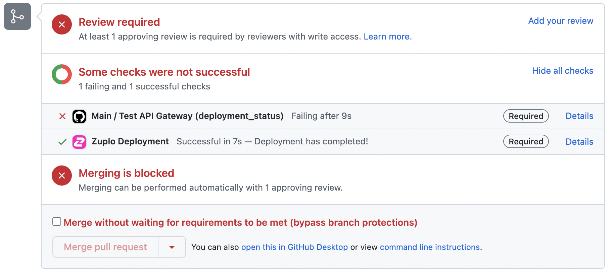

:::tip

These instructions assume that you are using custom GitHub Action workflow, in
conjunction with the Zuplo Git Integration. If you prefer setting up your own
CI/CD for more fine-grained control, please take a look at
[running your own CI/CD](../articles/custom-ci-cd.mdx).

:::

Using the Zuplo GitHub integration, tests can be run after a deployment with the
Zuplo Git Integration and used to block pull requests from being merged. This
can help ensure that changes to your Zuplo gateway won't break your production
environment.

The Zuplo Git Integration sets
[Deployments](https://docs.github.com/en/rest/deployments/deployments) and
[Deployment Statuses](https://docs.github.com/en/rest/deployments/statuses) for
any push to a GitHub branch.

Here is a simple GitHub Action that uses the Zuplo CLI to run the tests after
the deployment is successful. Notice how the property
`github.event.deployment_status.environment_url` is set to the `API_URL`
environment variable. This is one way you can pass the URL where the preview
environment is deployed into your tests.

```yaml title="/.github/workflows/main.yaml"
name: Main
on: [deployment_status]

jobs:
  test:
    name: Test API Gateway
    runs-on: ubuntu-latest

    steps:
      - uses: actions/checkout@v4
      - name: Use Node.js
        uses: actions/setup-node@v4
        with:
          node-version-file: ".nvmrc"

      - name: Run Tests
        # Useful properties 'environment', 'state', and 'environment_url'
        run:
          API_URL=${{ toJson(github.event.deployment_status.environment_url) }}
          npx zuplo test --endpoint $API_URL
```

[GitHub Branch protection](https://docs.github.com/en/repositories/configuring-branches-and-merges-in-your-repository/defining-the-mergeability-of-pull-requests/about-protected-branches)
can be set in order to enforce policies on when a Pull Request can be merged.
The example below sets the "Zuplo Deployment" and "Test API Gateway" as required
status that must pass.


When a developer tries to merge their pull request, they will see that the tests
haven't passed and the pull request can't be merged.



## Writing Tests

Using Node.js 18 and the Zuplo CLI, it's very easy to write tests that make
requests to your API using `fetch` and then validate expectations with `expect`
from [chai](https://www.chaijs.com/api/bdd/).

```js title="/tests/my-test.test.ts"
import { describe, it, TestHelper } from "@zuplo/test";
import { expect } from "chai";

describe("API", () => {
  it("should have a body", async () => {
    const response = await fetch(TestHelper.TEST_URL);
    const result = await response.text();
    expect(result).to.equal(JSON.stringify("What zup?"));
  });
});
```

Check out our
[other sample tests](https://github.com/zuplo/zup-cli-example-project/tree/main/tests)
to find one that matches your use-case.

:::tip

Your test files need to be under the `tests` folder and end with `.test.ts` to
be picked up by the Zuplo CLI.

:::

## Tips for writing tests

This section highlights some of the features of the Zuplo CLI that can help you
write and structure your tests. Check out our
[other sample tests](https://github.com/zuplo/zup-cli-example-project/tree/main/tests)
to find one that matches your use-case.

### Ignoring tests

You can use `.ignore` and `.only` to ignore or run only specific test. The full
example is at
[ignore-only.test.ts](https://github.com/zuplo/zup-cli-example-project/blob/main/tests/ignore-only.test.ts)

```js title="/tests/ignore-only.test.ts"
import { describe, it } from "@zuplo/test";
import { expect } from "chai";

/**
 * This example how to use ignore and only.
 */
describe("Ignore and only test example", () => {
  it.ignore("This is a failing test but it's been ignored", () => {
    expect(1 + 4).to.equals(6);
  });

  //   it.only("This is the only test that would run if it weren't commented out", () => {
  //     expect(1 + 4).to.equals(5);
  //   });
});
```

### Filtering tests

You can use the CLI to filter tests by name or regex. The full example is at
[filter.test.ts](https://github.com/zuplo/zup-cli-example-project/blob/main/tests/filter.test.ts)

```js title="/tests/filter.test.ts"
import { describe, it } from "@zuplo/test";
import { expect } from "chai";

/**
 * This example shows how to filter the test by the name in the describe() function.
 * You can run `zuplo test --filter '#labelA'`
 * If you want to use regex, you can do `zuplo test --filter '/#label[Aa]/'`
 */
describe("[#labelA #labelB] Addition", () => {
  it("should add positive numbers", () => {
    expect(1 + 4).to.equals(5);
  });
});
```

## Unit Tests & Mocking

:::caution{title="Advanced"}

Custom testing can be complicated and is best used only to test your own logic
rather than trying to mock large portions of your API Gateway.

:::

It's usually possible to use test frameworks like
[Mocha](https://github.com/zuplo/zuplo/tree/main/examples/test-mocks) and
mocking tools like [Sinon](https://sinonjs.org/) to unit tests handlers,
policies, or other modules. To see an example of how that works see this sample
on GitHub: https://github.com/zuplo/zuplo/tree/main/examples/test-mocks

Do note though that not everything in the Zuplo runtime can be mocked.
Additionally, internal implementation changes might cause mocking behavior to
change or break without notice. Unlike our public API we don't guarantee that
mocking will remain stable between versions.

Generally speaking, if you must write unit tests, it's best to test your logic
separately from the Zuplo runtime. For example, write modules and functions that
take all the arguments as input and return a result, but don't depend on any
Zuplo runtime code.

For example, if you have a function that uses an environment variable and want
to unit test it.

Don't do this:

```ts
import { environment } from "@zuplo/runtime";

export function myFunction() {
  const myVar = environment.MY_ENV_VAR;
  return `Hello ${myVar}`;
}
```

Instead do this:

```ts
export function myFunction(myVar: string) {
  return `Hello ${myVar}`;
}
```

Then write your test like this:

```ts
import { myFunction } from "./myFunction";

describe("myFunction", () => {
  it("should return Hello World", () => {
    expect(myFunction("World")).to.equal("Hello World");
  });
});
```

### Polyfills

If you are running unit tests in a Node.js environment, you may need to polyfill
some globals. Zuplo itself doesn't run on Node.js, but because Zuplo is built on
standard API, testing in Node.js is possible.

If you are running on Node.js 20 or later, you can use the `webcrypto` module to
polyfill the `crypto` global. You must register this polyfill before any Zuplo
code runs.

```js
import { webcrypto } from "node:crypto";
if (typeof crypto === "undefined") {
  globalThis.crypto = webcrypto;
}
```
