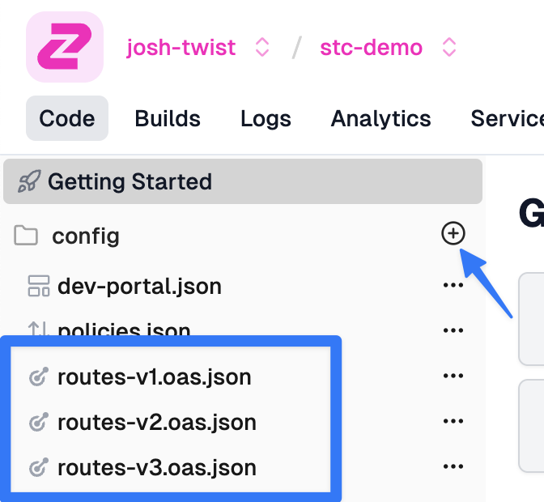

This is a brief guide explaining how you might approach versioning your APIs on
Zuplo. We use Zuplo internally at Zuplo and this is our approach.

The focus of our versioning approach leans on URL-based versioning which is our
recommended approach, read more at
[How to version an API](https://zuplo.com/blog/2022/05/17/how-to-version-an-api).

## Separate OpenAPI files

We recommend having separate OpenAPI files for different major versions of your
API. Fortunately, a single project in Zuplo can have as many OpenAPI routing
files as you like. The default one we create for you `routes.oas.json` can be
renamed, as shown here:



Note you can create a new OpenAPI file by clicking the '+' icon shown.

Each routing file would now have it's own routes, each prefixed by `/v1` and
`/v2`.

We also recommend updating the `info` properties in your OpenAPI file and
include the version as this will help your users disambiguate the version in
your developer portal:

```json

{
  "openapi": "3.1.0",
  "info": {
    "title": "My Api (v2)",
    "version": "2.0.0"
  },

```

When Zuplo generates your developer-portal we put each OpenAPI version into it's
own document and allow users to pick. This is currently presented in a dropdown:


## Using Zuplo as a versioning layer

Because Zuplo is a programmable gateway it's a powerful tool in your versioning
arsenal. For example, let's imagine you want to make a breaking change between
v1 and v2 of your `todos` API where the `todoItems` in v2 won't include a piece
of information in the previous version.

This can be entirely achieved in Zuplo by adding a v2 OpenAPI file and adding an
identical route from v1 but changing the path:

`/v1/todos` ==> `/v2/todos`

The only other change you'd need to make to this new version is to add an
outbound custom policy that removes the property, e.g.

```ts
export default async function policy(
  response: Response,
  request: ZuploRequest,
  context: ZuploContext,
  options: never,
  policyName: string,
) {
  if (response.status === 200) {
    const json = await response.json();
    json.forEach((item) => {
      delete item.userId;
    });

    return new Response(JSON.stringify(json), response);
  }

  return response;
}
```

And QED - your Zuplo gateway is being used to update your old API and make it
shiny and new.

There's a video accompaniment for this document on YouTube here:
[Versioning an API on Zuplo](https://youtu.be/U0_sfNf5x18)
