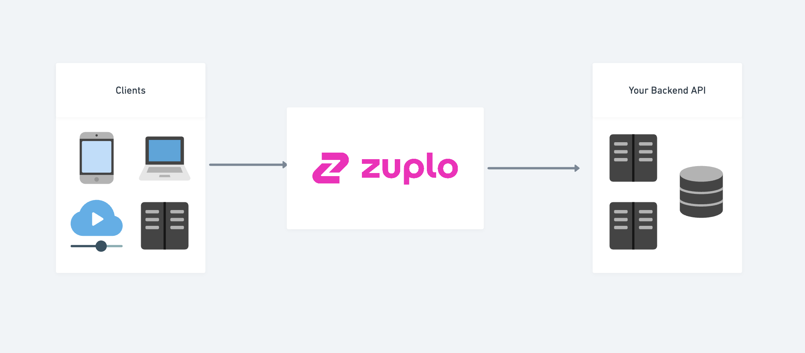
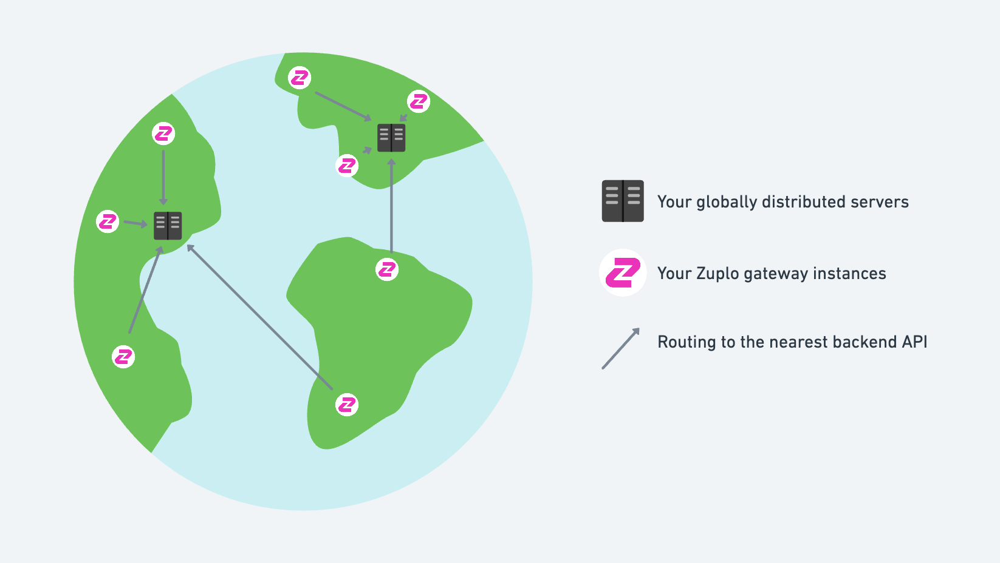

Zuplo is a light-weight, fully-managed API Management platform, built for
developers (GitOps, fast deployment, unlimited preview environments, etc.).
Hobbyist developers and Engineering leaders alike use Zuplo to quickly:

- [Add auth and access management](./step-3-add-api-key-auth.md)
- [Add rate limiting](./step-2-add-rate-limiting.md)
- Implement a programmable layer of abstraction between an API and its consumers
  (you can write code that executes inside the Gateway)
- Generate a [rich developer documentation experience](./developer-portal.md)
  with self-serve auth management and monetization

Zuplo doesn't come with the crazy costs, training courses, etc. of a traditional
API Management platforms, like Apigee or Azure APIM.

Zuplo embraces shift-left and infrastructure as code - the gateway definition is
all stored in text files that can be source controlled. We can deploy a new
environment, to the edge, in under 20s with a simple git commit.

Sound interesting to you? You can
[see Zuplo in action](https://zuplo.com/meeting?utm_source=blog) or
[get started with Zuplo](https://portal.zuplo.com/signup?utm_source=blog) for
free.

## Zuplo in your stack

Zuplo's core offering is a fully-managed, serverless gateway that runs at the
edge, in over 200 data-centers around the world. This has a number of advantages
as a gateway including:

- extreme redundancy and high availability built-in
- within 50ms of everybody on earth (amazing cache performance)

For this reason we consider the platform to be multi-cloud and have customers
with backends in AWS, Azure, GCP and private data-centers. We have
[multiple options for securing connectivity](./securing-your-backend) between
Zuplo and your backend API.

Zuplo typically sits between your clients and your backend (or origin) API. Your
clients could be other servers, mobile devices, browsers running websites or IoT
devices. The traffic is proxied through the Zuplo gateway where you can enforce
protections like rate-limiting and authentication, validate requests before they
hit your backend and much more.

We also have customers that have globally distributed backends (hosted by
multiple clouds). In this case, customers have deployed Zuplo and route to the
nearest data-center.

## Protocols

Zuplo can proxy any HTTP traffic and works well with REST, GraphQL, WebSockets
and other HTTP protocols (we've customers proxying SOAP over HTTP too). HTTP 2
is supported.

## Languages

Zuplo is configured using JSON configuration files and can be easily extended
using TypeScript / JavaScript. Your backend can be written in any language - we
have customers with backends coded in Go, C, Node, .Net, etc. As long as it
communicates via HTTP, Zuplo is a great choice.

## Integrations

We have support for integrations with DataDog (for monitoring, logging), GCP
Cloud Logging and are adding new integrations on demand for customers quickly.
Contact us if you need an integration that you don't see.

## Runtime

The Zuplo runtime is built on Web Worker technology - this is a server runtime
based on web standards that supports JavaScript and WASM code, and is used by
other services like Deno Deploy, Fastly, CloudFlare Workers and Vercel Edge
Functions.

This has several advantages including close to 0ms startup time for new nodes
increasing both API performance, throughput and scalability.

This makes Zuplo's extensibility easy to use as the concepts are the same as
browser scripting and well documented on platforms like MDN (e.g.
[Response Web API](https://developer.mozilla.org/en-US/docs/Web/API/Response))
and are discussed in depth on platform like
[stackoverflow](https://stackoverflow.com/).

## Performance and latency

Zuplo handles billions of request every month for our customers and has been
load tested to comfortably exceed 10,000 requests per second (including API key
security, rate-limiting and other policies).

Zuplo adds minimal latency to your backend - typically milliseconds, depending
on the complexity of your gateway. Our policies are highly tuned to reduce
latency and are adjustable to optimize for different scenarios.

## Multi-cloud

Many zuplo customers connect with services in Azure, AWS, GCP and even running
on raw metal in colo locations. Our unique edge deployment profile means we work
great with your API wherever it's and have a selection of options for
[securely connecting to your backend](./securing-your-backend.md).
