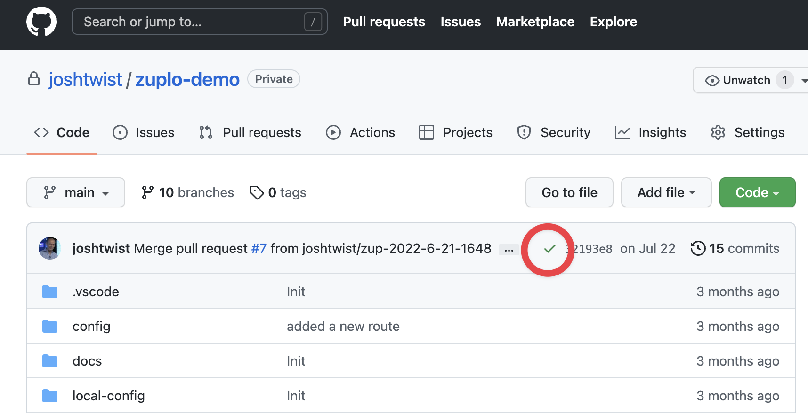

# Win a McLaren Lego Technic (Day 2)

Read on to learn how you can win a McLaren Lego Technic.

[Zuplo](https://zuplo.com) is a different kind of API gateway. We believe you make better APIs with tools engineers LOVE to use and can collaborate with, vs creating top-down Governance that you **force** on your engineering teams.

With Zuplo, teams can create unlimited live environments and each takes less than 30 seconds to deploy. Have some fun with this exercise and ask the team for more information!

It's programmable and gitops enabled. We make it easy for you to ship better APIs that other developers love.

The draw will be at 3:15pm (during the break) on October 19 - you'll need to be present to win your prize.

[Home](https://zuplo.com) | [Docs](/docs) | [Blog](/blog) | [Follow Us](https://twitter.com/zuplo)

---

## Deploy a gateway to the edge in seconds

:::caution

**We recommend completing the exercise on a laptop.** The Zuplo portal isn't designed to work on phones. You can also stop by the booth and use one of our computers if that is easier.

This contest is for registered attendees of API Conference, Berlin only.
[Full rules and terms](./conference-prize-terms.md)

:::

# Challenge

Submit by 3:15pm on the last day of the conference. Limit of one prize per person. You need an account with GitHub.com to complete this challenge.

## Part 1: Proxy an API

We're going to setup a gateway for an example API that could be your backend. And in just a few minutes we'll add API key authentication, rate-limiting and a developer portal!

### Step 1 - Sign up

Sign up for a zuplo account at [portal.zuplo.com](https://portal.zuplo.com)

### Step 2 - Create a gateway

You can use the same gateway you used in yesterdays challenge or, create a new gateway (it takes less than a minute).

In this exercise we will create a simple gateway over a demo 'todo' API. You can imagine this would be your API. In this exercise, we want to show how fast and easy it is to deploy Zuplo - one of the main reasons businesses love us.

### Step 3 - Add a new route

See [the documentation about Url Rewrites](../handlers/url-rewrite.md) for more information.

Open **Routes** and add a route to the example project.

- It should support `GET` only
- The path should be `/todos`
- Set the URL Rewrite to the legacy e-commerce API as follows
  `https://jsonplaceholder.typicode.com/todos`
- Save your changes (Cmd ⌘ + S or Ctrl + S)

### Step 4 - Install the GitHub Deployer so we can deploy your app

Follow the instructions here: [https://zuplo.com/docs/articles/github-source-control/](https://zuplo.com/docs/articlesv/github-source-control/) to install the [GitHub Deployer](https://github.com/apps/zuplo/installations/new) - this deploys your gateway to the edge at 250+ datacenters.

### Step 5 - Connect your project to Source Control

Go to the "Settings" tab ('cog' at center-bottom left) and choose "Source Control". Connect your GitHub account and then Create a Repository for your project....

### Step 6 - As if by magic, your app will be automatically deployed to the edge

If you installed the GitHub deployer correctly, you should see a small green check in GitHub (see below).

If you click on this you will see details of your new cloud deployment and how fast we deployed you to 250+ data-centers around the world.

### Show us your deployed project

- Show the Zuplo staff your deployed GitHub project.
- Good luck with the draw!
