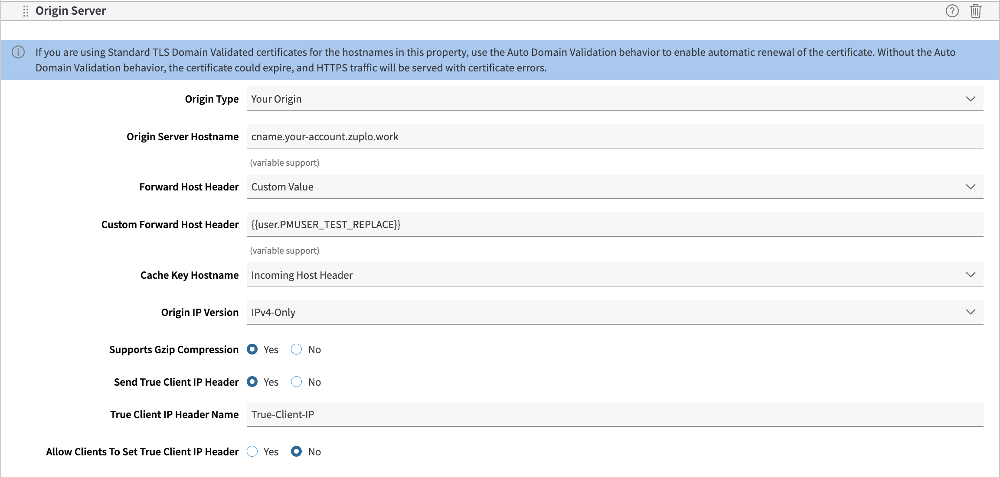
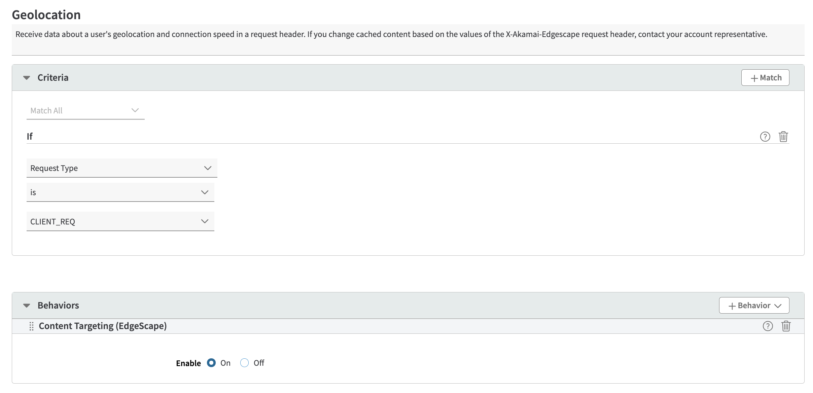

When running managed dedicated on the Akamai Cloud, you will configure the
Akamai CDN to serve your API Gateway and Developer Portal.

This document outlines the configurations you need to add to your Akamai CDNs to
set them up to access your API gateway and developer portal.

All configurations in this guide were done on the Akamai Property Manager, see
the
[Akamai docs](https://techdocs.akamai.com/property-mgr/docs/know-your-around)
for more details.

## Domains

Before you configure the CDN for your API Gateway and Developer Portal, you will
to decide how you would like your domains to be setup. Generally, you will
provision two types of domains - a static domain for production and wildcard
domains for preview environments.

For preview environments, you will use wildcard domains so that each environment
(i.e. each Git branch) will have its own subdomain. For example, you might use
`*.api.example.com` for the API gateway and `*.dev.example.com` for the
developer portal. This will allow you to have URLs for each environment like
`https://my-environment-123.api.example.com` and
`https://my-environment-123.dev.example.com`.

For production, you will want to use friendly domains like `api.example.com` and
`developers.example.com`. Some customers also choose to host environments like
staging on custom domains as well. This is up to you, just let your Zuplo
account manager know how you would like to set up your domains.

The setup for both configurations is the same, but the domain name and
certificates will be different.

## Prerequisites

1. Provision the domains that you would like these CDNs to have and certificates
   for those domains. You will need a domain for the API gateway, as well as a
   domain for the dev portal.
2. Request the Origin URLs for your API gateway and developer portal from your
   Zuplo account manager.
3. Let your Zuplo account manager know what hostnames/domains you will be using
   in your CDNs.

## API Gateway CDN

This section guides you on how to configure your API Gateway CDN.

Add the API gateway domain you provisioned to the Property Hostname for the API
Gateway CDN. See the Akamai docs on
[configuring HTTPS hostnames](https://techdocs.akamai.com/property-mgr/docs/serve-content-over-https).

Make the following behavior changes:

1. Configure the Origin URL to point to the URL given to you by Zuplo for your
   API gateway. Ensure that the Forward Host Header is configured to be the
   Origin Hostname. This would look something similar to below:
   

2. Turn on Content Targeting (Edgescape) in the Geolocation rule in the Property
   Manager Sidebar.
   

3. Enable all Allowed Methods rules (POST, OPTIONS, PUT, DELETE, PATCH) in the
   Property Manager sidebar.

## Developer Portal CDN

This section guides you on how to set up the Developer Portal CDN.

Add a property hostname with a wildcard to your Developer Portal CDN, similar to
below:

Under the Default Rule page, add the following behaviors:

1.  Configure the origin URL to be the URL given to be the one given to you by
    Zuplo for your Developer Portal. This will look similarly to how you
    configured it for your API Gateway CDN.

2.  Modify Incoming Request Header behavior, with the following fields: Action:
    Add, Select Header Name: Other, Custom Header Name: X-Forwarded-Host, Header
    Value: \{\{builtin.AK_HOST\}\}. This should look like the picture below:

    

3.  Caching, which should have the following configurations: Caching Option
    should be set to "Honor origin Cache-Control and Expires", Force Validation
    of stale objects should be set to "Always revalidate with origin", Default
    Maxage should be set to 0 seconds, and all the Cache-Control header
    directives should be enabled. This will look like below:

    

Congratulations, you've set up your Akamai CDNs to serve your API Gateway and
Developer Portal! At this point, you should be able to test that these things
are working by either hitting an endpoint in your API gateway (e.g
mygateway.com/my/endpoint), or navigating to a page in your developer portal
(e.g myportal.com/home).
