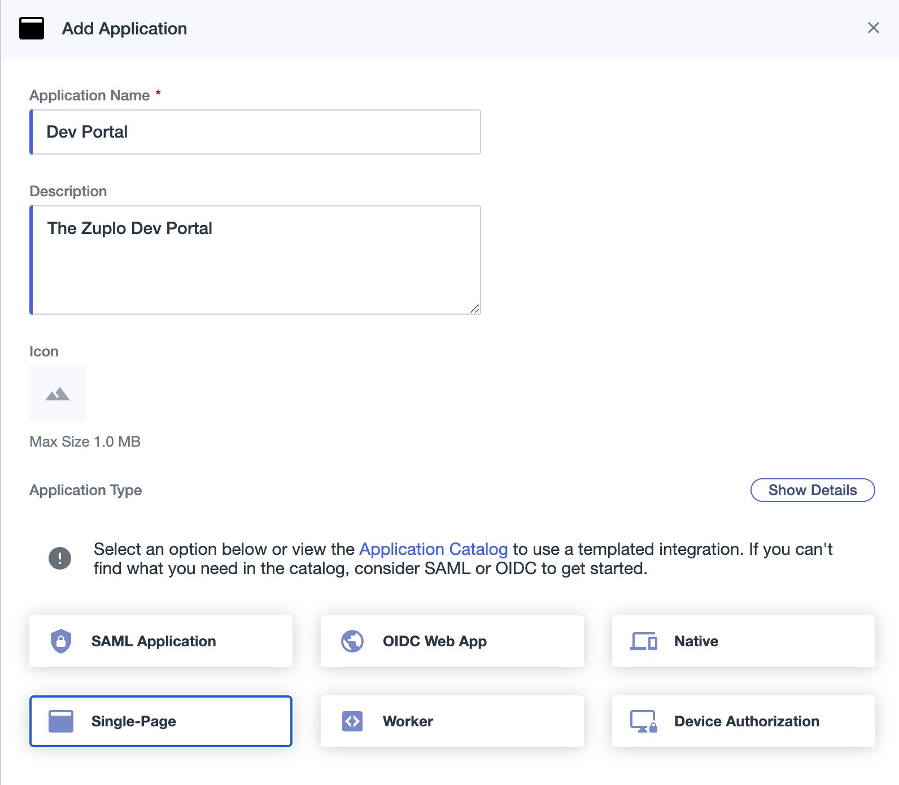

This document will walk you through setting up PingOne as an identity provider
for your Zuplo Developer Portal.

First, create a new application in PingOne. Select "Single-Page" as the
application type. You can set the title and description to whatever you like.

