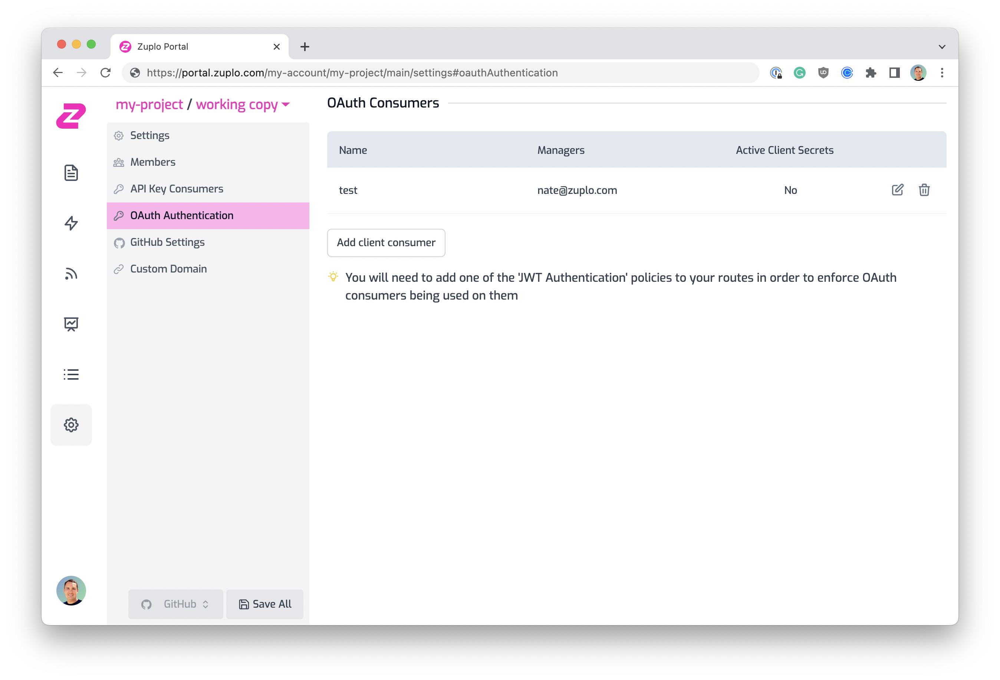
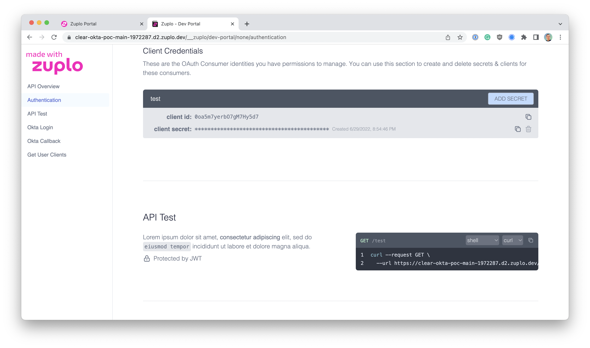

Zuplo allows developers to add JWT authentication to their API in only a few minutes. With Zuplo's OAuth Client Management you can enable your customers to create OAuth clients in [the developer portal](../developer-portal/index.md) that allow them to securely access your API with custom scopes and permissions.

Zuplo's OAuth Client Management integrates with the most popular identity providers such as Okta and Auth0 to give your customers or developers a seamless experience using your API.

## OAuth Client Consumers

OAuth Client Consumers are people, customers, partners, services, etc. that can create and manage OAuth Clients for your API. OAuth Clients are managed by **Managers**. Managers are people authorized to create and manage OAuth Clients and client secrets. Adding managers to the OAuth Client Consumer is done by setting email addresses for each user.

Each Manager who logs into the Developer Portal can issue or manage OAuth clients and secrets. Note that every manager has access to the **SAME** OAuth clients and secrets. If you would like each user of your API to have their own OAuth Clients, make each user their own OAuth Client Consumer with a single manager.

### Manage OAuth Client Consumers

OAuth Client Consumers can be managed in the **OAuth Client Consumers** section under the <SettingsTabIcon /> **Settings** tab.



To add a new OAuth Client Consumer click the **Add new consumer** button and complete the form.


## OAuth Authentication & Authorization

Authentication and Authorization for OAuth clients is handled using standard JWT authentication. Zuplo comes with several JWT Authentication policies out of the box.

- [OpenId JWT Authentication Policy](../policies/open-id-jwt-auth-inbound.md)
- [Auth0 JWT Authentication Policy](../policies/auth0-jwt-auth-inbound.md)
- [Okta JWT Authentication Policy](../policies/okta-jwt-auth-inbound.md)
- [AWS Cognito JWT Authentication Policy](../policies/cognito-jwt-auth-inbound.md)

When a user is authenticated with a JWT policy the claims of their `access_token` will be available on the `request.user` object. You can use these claims to authorize or modify how your routes respond to various requests.

```ts
async function (request: ZuploRequest, context: ZuploContext) {
  if (request.user.data["https://example.com/claim1/"] === "this-is-a-claim") {
    // do something
  }
}
```

## OAuth Clients in the Developer Portal

When OAuth Client Managers login to the Developer Portal they can create OAuth Clients and manage client secrets.


