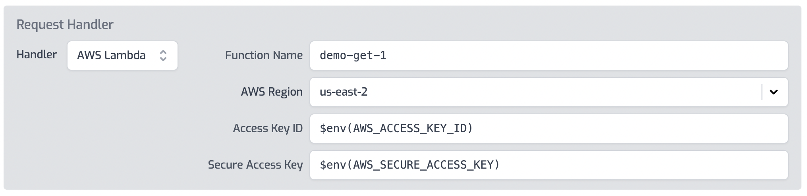

The AWS Lambda handler is used to send requests to AWS Lambda. This handler can
be used as an alternative to AWS API Gateway when exposing Lambda functions as
an API or HTTP endpoint.

Note: Many customers use Zuplo's AWS Lamdba handler as a replacement for using
AWS API Gateway, however it shouldn't be considered a complete fire-and-forget
replacement. Some features, such as the way certain errors are handled may
differ. We recommend testing your API to ensure the behavior is as you expect,
especially in migration scenarios.

## IAM Permissions

Zuplo will need to be granted access to execute your Lambda function. It's
recommended you create an
[IAM user](https://docs.aws.amazon.com/IAM/latest/UserGuide/id_users_create.html)
and grant that account only the permission needed to invoke the lambda function.
The IAM use doesn't require console access, only API access. The IAM user used
by Zuplo requires the
[**AWSLambdaRole**](https://docs.aws.amazon.com/lambda/latest/dg/access-control-identity-based.html)
role. This role can be scoped to only the specific Lambda functions required.

## Setup via Portal

To setup the AWS Lambda handler in the portal UI, select the AWS Lambda handler
on any route.



Configure the properties for your AWS Lambda function.

:::warning

Don't add the AWS Secure Access Key directly in the `routes.oas.json` file.
Instead use environment variables like `$env(AWS_SECURE_ACCESS_KEY)`

:::

## Setup via routes.oas.json

The AWS Lambda handler can be setup by editing the `routes.oas.json` file
directly by configuring the `handler` property on any route's `x-zuplo-route`
property.

```json
{
  "handler": {
    "export": "awsLambdaHandler",
    "module": "$import(@zuplo/runtime)",
    "options": {
      "accessKeyId": "$env(AWS_ACCESS_KEY_ID)",
      "functionName": "demo-post-1",
      "region": "us-east-2",
      "secretAccessKey": "$env(AWS_SECURE_ACCESS_KEY)"
    }
  }
}
```

## Binary Media Types

For content types, the `binaryMediaTypes` option allows specifying which content
types get converted to base64 encoded strings when sent as the body to the AWS
Lambda function. See
[AWS docs for details](https://docs.aws.amazon.com/apigateway/latest/developerguide/api-gateway-payload-encodings.html).

```json
{
  "handler": {
    "export": "awsLambdaHandler",
    "module": "$import(@zuplo/runtime)",
    "options": {
      "accessKeyId": "$env(AWS_ACCESS_KEY_ID)",
      "functionName": "demo-post-1",
      "region": "us-east-2",
      "secretAccessKey": "$env(AWS_SECURE_ACCESS_KEY)",
      "binaryMediaTypes": ["image/png", "application/pdf"]
    }
  }
}
```

## X-Amzn-Trace-Id Header

For the purposes of troubleshooting and tracing, it can be useful to return the
`X-Amzn-Trace-Id` header in the response. This can help correlate AWS Lambda
events or errors with Zuplo requests/responses. This header is disabled by
default, but it can be enabled by setting the configuration option
`returnAmazonTraceIdHeader` to `true`.

```json
{
  "handler": {
    "export": "awsLambdaHandler",
    "module": "$import(@zuplo/runtime)",
    "options": {
      "accessKeyId": "$env(AWS_ACCESS_KEY_ID)",
      "functionName": "demo-post-1",
      "region": "us-east-2",
      "secretAccessKey": "$env(AWS_SECURE_ACCESS_KEY)",
      "returnAmazonTraceIdHeader": true
    }
  }
}
```

## Compressed Body Content

:::note

This is provided as a work-around for certain Lambda + AWS API Gateway migration
scenarios and isn't recommended to use on new deployments

:::

The Zuplo handler supports `gzip` and `deflate` compression of the content of
the AWS Lambda response `body` property. In order to instruct the Zuplo handler
to decompress the body content add a property on the outgoing event called
`bodyEncoding` and set the value to `gzip` or `deflate`.

The response event would look like this:

```json
{
  "isBase64Encoded": true,
  "bodyEncoding": "gzip",
  "body": "COMPRESSSED AND BASE64 ENCODED BODY",
  "...": "other properties..."
}
```

## API Gateway Compatibility

The AWS Lambda handler can also call Lambda functions that were built for API
Gateway.

Setting `options.useLambdaProxyIntegration` to `true` will tell the handler to
call the function with the event format that matches with AWS API Gateway. You
can also choose between the payload format by setting
`options.payloadFormatVersion` to either `1.0` or `2.0`.

The value for `requestContext.resourcePath` sent to the AWS Lambda function is
the parameterized path of the route. Zuplo uses path-to-regex style paths (for
example `/my/route/:param1`) instead of OpenAPI style paths, for example,
`/my/route/{param1}` for routes. By default, the value of `resourcePath` is the
Zuplo route value. Setting `useAwsResourcePathStyle` to `true` will convert the
value to the AWS format.

For more details about the AWS payload formats see
[AWS's documentation](https://docs.aws.amazon.com/apigateway/latest/developerguide/http-api-develop-integrations-lambda.html).

Below is an example lambda handler configured for proxy integration with payload
format 2.0.

```json
{
  "handler": {
    "export": "awsLambdaHandler",
    "module": "$import(@zuplo/runtime)",
    "options": {
      "accessKeyId": "$env(AWS_ACCESS_KEY_ID)",
      "functionName": "demo-post-1",
      "region": "us-east-2",
      "secretAccessKey": "$env(AWS_SECURE_ACCESS_KEY)",
      "useLambdaProxyIntegration": true,
      "payloadFormatVersion": "2.0",
      "useAwsResourcePathStyle": true
    }
  }
}
```
