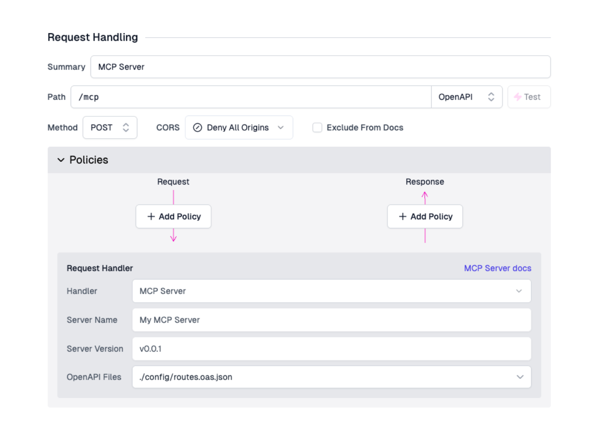

The MCP (Model Context Protocol) Server handler allows you to run a lightweight,
stateless MCP server on your gateway that automatically transforms your API
routes into MCP tools.

🙋‍♀️ Want to try it out? Check out the
[MCP Quickstart](../articles/mcp-quickstart.md).

This enables your API gateway to seamlessly serve external AI tools and agents
through [Model Context Protocol](https://modelcontextprotocol.io/introduction)
interactions by using your existing APIs, without needing to duplicate
functionality or rebuild business logic in your backend.

Each MCP Server handler has a 1:1 relationship with a route. That means one
route can host one server.

A single MCP server may have many tools, where each tool interfaces with an API
route in your gateway. You can compose multiple MCP servers on different routes
to tailor MCP tools for each server's specific purpose.

## Setup via Portal

Open the **Route Designer** by navigating to the **Files** tab, then click
**routes.oas.json**. For any route definition, select **MCP Server** from the
**Request Handlers** drop-down. Set the method to **POST**.

Configure the handler with the following required options:

- **Server Name** - The name of the MCP server. AI MCP clients will read this
  name when they initialize with the server.
- **Server Version** - The version of your MCP server. AI MCP clients read this
  version when they initialize with the server and may make autonomous decisions
  based on the versioning of your MCP server and the instructions they've been
  given.



Next, configure your routes to be transformed into MCP tools (see Configuration
section below).

## Setup via routes.oas.json

The MCP Server handler can be manually added to the **routes.oas.json** file
with the following route configuration:

```json
"paths": {
  "/mcp": {
    "x-zuplo-path": {
      "pathMode": "open-api"
    },
    "post": {
      "summary": "MCP Server",
      "x-zuplo-route": {
        "corsPolicy": "none",
        "handler": {

          // The MCP Server Handler handler
          // and required options

          "export": "mcpServerHandler",
          "module": "$import(@zuplo/runtime)",
          "options": {
            "name": "example-mcp-server",
            "version": "1.0.0",
            "debugMode": false,
          }
        },
        "policies": {
          "inbound": []
        }
      }
    }
  }
}
```

## Configuration

The MCP Server handler requires the following configurations:

- `name` - The name identifier of the MCP server
- `version` - The version of the MCP server protocol to use
- `debugMode`: Verbose logs on server startup, initialization, tool listing, and
  tool calls. NOT recommended for production environments.

### MCP `2025-06-18` Global Options

:::warning

These options are part of the new
[MCP specification (2025-06-18)](https://modelcontextprotocol.io/specification/2025-06-18).
Some MCP clients **may not yet support these features**. If you experience
compatibility issues with your MCP client, ensure your `outputSchema` is a valid
`type: object` JSON Schema and `structuredContent` is also of `type: object`.

:::

- `includeOutputSchema` (optional, default: `false`) - Whether to include output
  schema from the route's OpenAPI response schema. When `true`, the schema from
  successful responses (2xx) will be used as `outputSchema` for MCP tools.
- `includeStructuredContent` (optional, default: `false`) - Whether to include
  structured content in responses. When `true`, response JSON will be parsed and
  included as `structuredContent`. When `false`, only `text` content will be
  returned.

### OpenAPI Routes to MCP Tools

There are two options for configuring which API routes become MCP tools:

#### Option 1: Transform Entire OpenAPI Files

Transform all routes from OpenAPI files into MCP tools by specifying
`openApiFilePaths`. In this, the default setup, you list the OpenAPI files 
(*.oas.json) that you want the MCP Server to scan. It will automatically expose
all endpoints as an MCP tool in those OpenAPI docs:

```json
"paths": {
  "/mcp": {
    "post": {
      "x-zuplo-route": {
        "handler": {
          "export": "mcpServerHandler",
          "module": "$import(@zuplo/runtime)",
          "options": {
            "openApiFilePaths": [
              {
                "filePath": "./config/weather.oas.json"
              },
              {
                "filePath": "./config/todos.oas.json"
              }
            ]
          }
        }
      }
    }
  }
}
```

- `filePath`: Path to an OpenAPI JSON spec file (relative to the project root)

To exclude specific routes when using this option, add
`x-zuplo-route.mcp.enabled: false` to those routes (see OpenAPI Configuration
section).

#### Option 2: Transform Individual Routes

Add specific routes as MCP tools using the `openApiTools` array. Specify
**either** `path` or `operationId`, plus the required `method`:

```json
"paths": {
  "/mcp": {
    "post": {
      "x-zuplo-route": {
        "handler": {
          "export": "mcpServerHandler",
          "module": "$import(@zuplo/runtime)",
          "options": {
            "openApiTools": [
              {
                "path": "/todos",
                "method": "GET",
                "name": "get_todos",
                "description": "Gets todos from the backend"
              },
              {
                "operationId": "get_todos_by_priority",
                "method": "GET"
              }
            ]
          }
        }
      }
    }
  }
}
```

- `path`: The route path to convert to an MCP tool
- `operationId`: Alternative to `path` - uses the route's globally unique
  OpenAPI `operationId`
- `method`: The HTTP method (`GET`, `POST`, etc.)
- `name` (optional): Manually overrides the tool's name
- `description` (optional): Manually overrides the tool's description
- `includeOutputSchema` (optional): Override the global `includeOutputSchema`
  setting for this specific route
- `includeStructuredContent` (optional): Override the global
  `includeStructuredContent` setting for this specific route

### Tool names and descriptions

Regardless of which option you use, MCP tools are configured as follows:

- **Tool names**: Uses the route's `operationId` if available, otherwise falls
  back to a generated `METHOD_ROUTE` format (e.g., `GET_todos`)
- **Tool descriptions**: Derived from (in order of priority):
  1. The route's `description` field
  2. The route's `summary` field
  3. A generated description if neither is available

**Best Practice**: Always set meaningful `operationId`s (like `get_users`,
`create_new_deployment`, or `update_shopping_cart`) and descriptions as these
help LLMs understand exactly _what_ each tool does.

:::tip

Read more about authoring usable tools and good prompt engineering practices
with
[Anthropic's Prompt engineering overview](https://docs.anthropic.com/en/docs/build-with-claude/prompt-engineering/overview).

:::

## OpenAPI Route Configuration

Control MCP behavior for individual routes using the `x-zuplo-route` extension
and the `mcp` options:

```json
"paths": {
  "/internal-endpoint": {
    "get": {
      "x-zuplo-route": {
        "mcp": {
          "enabled": false
        }
      }
    }
  }
}
```

- `enabled` (default: `true`) - Whether the route should be available as an MCP
  tool. Useful for excluding routes when using `openApiFilePaths`.

## Authentication

### OAuth Authentication

The MCP Protocol natively supports OAuth authentication to enable MCP Clients to
authenticate and authorize themselves when calling tools. For more information,
see the
[official MCP Authentication documentation](https://modelcontextprotocol.io/specification/draft/basic/authorization).

Zuplo allows you to configure any of the built-in OAuth policies (like Auth0,
Okta, etc.) on the MCP Server route to secure it. To enable OAuth
authentication, you will need to have an OAuth Authorization server configured.
Specifically, the OAuth Authorization server will need to support the following
things:

1. (Optional but recommended) OAuth 2.0 Dynamic Client Registration
2. Authorization Code Grant with PKCE
3. Refresh Tokens

For an example of a basic configuration of an Authorization Server with Auth0,
see:
[Setting up Auth0 as an Authentication Server for MCP OAuth Authentication](../articles/configuring-auth0-for-mcp-auth).

Once you have configured your authorization server, you can do the following to
enable OAuth authentication on your MCP Server:

1. Create an OAuth policy on your MCP Server route. This policy will need to
   have the option `"oAuthResourceMetadataEnabled": true`, for example:

   ```json
   {
     "name": "mcp-oauth-inbound",
     "policyType": "oauth-inbound",
     "handler": {
       "export": "Auth0JwtInboundPolicy",
       "module": "$import(@zuplo/runtime)",
       "options": {
         "auth0Domain": "my-auth0-domain.us.auth0.com",
         "audience": "https://my-mcp-audience",
         "oAuthResourceMetadataEnabled": true
       }
     }
   }
   ```

   In this example, the audience should be the identifier of the Auth0 API you
   want your MCP Server to be protected by. For more information on configuring
   OAuth JWT policies, see the
   [OAuth Policy docs](../articles/oauth-authentication.md).

2. Add the OAuth policy to the MCP Server route. For example:

   ```json
   "paths": {
     "/mcp": {
       "post": {
         "x-zuplo-route": {
           // etc. etc.
           // other properties and route handlers for MCP

           "policies": {
             "inbound": [
               "mcp-oauth-inbound"
             ]
           }
         }
       }
     }
   }
   ```

3. Add the `OAuthProtectedResourcePlugin` to your `runtimeInit` function in the
   `zuplo.runtime.ts` file:

   ```ts
   import { OAuthProtectedResourcePlugin } from "@zuplo/runtime";

   export function runtimeInit(runtime: RuntimeExtensions) {
     runtime.addPlugin(
       new OAuthProtectedResourcePlugin({
         authorizationServers: ["https://your-auth0-domain.us.auth0.com"],
         resourceName: "My MCP OAuth Resource",
       }),
     );
   }
   ```

   See the
   [OAuth Protected Resource Plugin docs](../programmable-api/oauth-protected-resource-plugin)
   for more details.

### API Key Auth

An MCP server on Zuplo can be configured to use an API key from a query
parameter using the
[Query Parameter to Header Policy](../../policies/query-param-to-header-inbound).

:::warning

Currently, API keys are not supported directly by MCP. But using a API key via
query params transformed through your Zuplo gateway is a great way to get up and
running quickly with an MCP server.

:::

Configure the policy to expect a query param and inject it as an Auth header:

```json
{
  "policies": [
    {
      "name": "mcp-query-param-to-header-inbound",
      "policyType": "query-param-to-header-inbound",
      "handler": {
        "export": "QueryParamToHeaderInboundPolicy",
        "module": "$import(@zuplo/runtime)",
        "options": {
          "queryParam": "apiKey",
          "headerName": "Authorization",
          "headerValue": "Bearer {value}"
        }
      }
    }

    // etc. etc. other policies, your API key policy
  ]
}
```

Then, to secure your MCP endpoint, add the "query param to header" policy
**_before_** your API key policy:

```json
{
  "paths": {
    "/mcp": {
      "post": {
        "x-zuplo-route": {
          // etc. etc.
          // other properties and route handlers for MCP

          "policies": {
            "inbound": [
              "mcp-query-param-to-header-inbound",
              "api-key-auth-inbound"
            ]
          }
        }
      }
    }
  }
}
```

Will will effectively transform the query param into a `Authorization: Bearer`
header and pass those through to other routes on your gateway.

Then, when using MCP clients, simply add your API key as a query param! For
example, in Cursor:

```json
{
  "mcpServers": {
    "my-zuplo-mcp-server": {
      "url": "https://my-server.zuplo.com/mcp?apiKey=123abc"
    }
  }
}
```

## Testing

### MCP Inspector

Use the [MCP Inspector](https://github.com/modelcontextprotocol/inspector), a
developer focused tool for building MCP servers, to quickly and easily test out
your MCP server:

```sh
npx @modelcontextprotocol/inspector
```

By default, this will start a local MCP proxy and web app that you can use on
`localhost` to connect to your server, list tools, call tools, view message
history, and more.

To connect to your remote Zuplo MCP server in the Inspector UI:

1. Set the **Transport Type** to "Streamable HTTP"
2. Set the **URL** to your Zuplo gateway with the route used by the MCP Server
   Handler (i.e., `https://my-gateway.zuplo.dev/mcp`)
3. If you have configured OAuth authentication, you will need to login using the
   OAuth flow using the **Open Auth Settings** button.
4. Hit **Connect**.

### Curl

For more fine grained debugging, utilize
[MCP JSON RPC 2.0 messages](https://modelcontextprotocol.io/specification/2025-03-26/basic)
directly with curl. There are lots of different interactions and message flows
supported by MCP, but some useful ones include:

#### Ping

To send a
[simple "ping" message](https://modelcontextprotocol.io/specification/2025-03-26/basic/utilities/ping),
which can be useful for testing availability of your MCP server:

```sh
curl https://my-gateway.zuplo.dev/mcp \
    -X POST \
    -H 'accept: application/json, text/event-stream' \
    -d '{
  "jsonrpc": "2.0",
  "id": "0",
  "method": "ping"
}'
```

#### List tools

To see
[what tools a server has registered](https://modelcontextprotocol.io/specification/2025-03-26/server/tools#listing-tools):

```sh
curl https://my-gateway.zuplo.dev/mcp \
    -X POST \
    -H 'accept: application/json, text/event-stream' \
    -d '{
  "jsonrpc": "2.0",
  "id": "0",
  "method": "tools/list"
}'
```

#### Call tool

To
[manually invoke a tool by name](https://modelcontextprotocol.io/specification/2025-03-26/server/tools#calling-tools):

```sh
curl https://my-gateway.zuplo.dev/mcp \
    -X POST \
    -H 'accept: application/json, text/event-stream' \
    -d '{
  "jsonrpc": "2.0",
  "id": "1",
  "method": "tools/call",
  "params": {
    "name": "my_tool",
    "arguments": {}
  }
}'
```

For more complex tools, you'll need to provide the schema compliant `arguments`.
Note the `inputSchema` for the tool from `tools/list` to appropriately craft the
`arguments`.

:::tip

Read more about how calling tools works in
[the Model Context Protocol server specification](https://modelcontextprotocol.io/specification/2025-03-26/server/tools).

:::

### OAuth Testing

If you have configured OAuth authentication for your MCP Server, you can use the
MCP Inspector to test the OAuth flow.

Hit the **Open Auth Settings** button in the Inspector UI to start the OAuth
flow. When first setting up the OAuth flow, it is recommmended to use the
**Guided OAuth Flow** which you will see when you open the OAuth settings. This
will allow you to debug the flow step by step.

The OAuth flow involves the following steps, as shown in the MCP inspector
guided auth flow. After you've checked each step, click the **Continue** button
in the MCP Inspector UI to move to the next step.

1. **Metadata Discovery**: The MCP Inspector will make a request to the
   `.well-known/oauth-protected-resource` endpoint to learn about the OAuth
   configuration. The MCP Inspector will then make a request to the
   Authorization server which you configured in the
   `OAuthProtectedResourcePlugin`, which will return the metadata it needs to
   continue with the OAuth flow.

   If you see errors in this part, check that you have correctly added the
   `OAuthProtectedResourcePlugin` to your `zuplo.runtime.ts` file, and that you
   have correctly configured the `authorizationServers` value to be the
   canonical URL of your Authorization server, and registered an OAuth policy to
   the route of your MCP server.

2. **Client Registration**: The MCP Inspector will try to use
   [Dynamic Client Registration](https://modelcontextprotocol.io/specification/draft/basic/authorization#dynamic-client-registration)
   to register a new client with the Authorization server. Note that not all MCP
   Clients require this, however at this time, the MCP Inspector does. You will
   need to enable Dynamic Client Registration on your Authorization server if
   you want to test the full flow through the MCP Inspector.

   If you see errors in this step, check that you have enabled Dynamic Client
   Registration on your Authorization server.

3. **Preparing Authorization**: The MCP Inspector will then redirect the user to
   the authorization server to login and authorize the MCP Client. Click the
   redirect link in the Authorization URL section to be prompted to login. After
   logging in, you will be given a code to copy in to the next step.

4. **Request Authorization and acquire authorization code**: Take the copied
   code from the last step and paste it in to the MCP Inspector and input it
   into the box.

5. **Token Request**: The MCP Inspector will do PKCE and make a request to the
   `token` endpoint of your Authorization server to exchange the authorization
   code for an access token. This is attached as the Authorization header when
   calling your MCP server, typically as a Bearer token.

6. **Authentication Complete**: You should now see a success message in the MCP
   Inspector. You can now hit the **Connect** button to connect to your MCP
   server.

If you see errors in the flow in steps 2-6, check that you have correctly
configured your Authorization server to support the OAuth 2.0 Authorization Code
Grant with PKCE and Refresh Tokens.

### MCP Client

By connecting to an LLM enabled MCP Client, you can test the true end to end
experience.

Many clients (like OpenAI, Claude Desktop, or Cursor) let you define the remote
server URL and the name. For example,
[in Cursor](https://docs.cursor.com/context/model-context-protocol), you can add
your MCP server like so:

```json
{
  "mcpServers": {
    "my-custom-mcp-server": {
      "url": "https://my-gateway.zuplo.dev/mcp"
    }
  }
}
```
