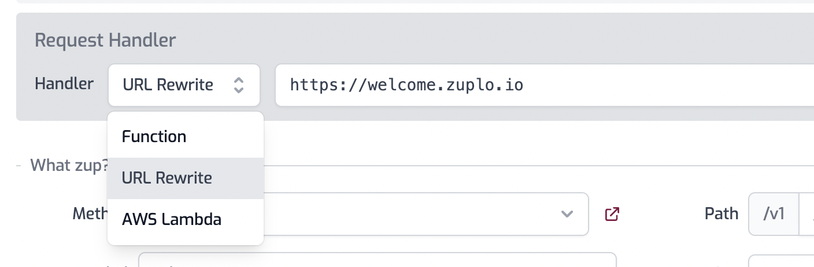

The URL Rewrite handler proxies and rewrites requests to different APIs without
writing any code. It provides powerful URL transformation capabilities, allowing
you to map request data and parameters to custom URL patterns on other hosts.

:::note

Handler Composition Combine the URL Rewrite handler with policies such as the
[Change Method Inbound](/docs/policies/change-method-inbound) policy to modify
virtually any aspect of your request.

:::

## Setup via Portal

The Rewrite Handler can be added to any route using the Route Designer. Open the
**Route Designer** by navigating to the **Code** tab then click
**routes.oas.json**. Inside any route, select **URL Rewrite** from the **Request
Handlers** drop-down.



In the text box enter the URL to rewrite the request. Values can be mixed into
the URL string using JavaScript string interpolation syntax. For example:

```txt
https://echo.zuplo.io/${method}/${params.productId}
```

The following objects are available for substitution:

- `env` - the environment object, to access
  [Environment Variables](../articles/environment-variables.mdx)
- `request: ZuploRequest` - the full
  [`ZuploRequest`](../programmable-api/zuplo-request.mdx) object
- `context: ZuploContext` - the
  [`ZuploContext`](../programmable-api/zuplo-context.mdx) object without
  functions.
- `params: Record<string, string>` - The parameters of the route. For example,
  `params.productId` would be the value of `:productId` in a route.
- `query: Record<string, string>` - The query parameters of the route. For
  example, `query.filterBy` would be the value of `?filterBy=VALUE`.
- `headers: Headers` - the incoming request's
  [headers object](https://developer.mozilla.org/en-US/docs/Web/API/Headers)
- `url: string` - The full incoming request as a string
- `host: string` - The
  [`host`](https://developer.mozilla.org/en-US/docs/Web/API/URL/host) portion of
  the incoming URL
- `hostname: string` - The
  [`hostname`](https://developer.mozilla.org/en-US/docs/Web/API/URL/hostname)
  portion of the incoming URL
- `pathname: string` - The
  [`pathname`](https://developer.mozilla.org/en-US/docs/Web/API/URL/pathname)
  portion of the incoming URL
- `port: string` - The
  [`port`](https://developer.mozilla.org/en-US/docs/Web/API/URL/port) portion of
  the incoming URL
- `search` - The
  [`search`](https://developer.mozilla.org/en-US/docs/Web/API/URL/search)
  portion of the incoming URL

Use the following methods to encode portions of the URL:

- `encodeURIComponent`: The
  [`encodeURIComponent()`](https://developer.mozilla.org/en-US/docs/Web/JavaScript/Reference/Global_Objects/encodeURIComponent)
  function encodes a URI by replacing each instance of certain characters with
  escape sequences.
- `e`: An alias to `encodeURIComponent` to help keep URLs more readable. Can be
  used like `${e(params.productId)}`

### Example Values

A few examples of the values of various substitutions.

- `${headers.get("content-type")}` - `"application/json"`
- `${host}` - `"example.com:8080"`
- `${hostname}` - `"example.com"`
- `${method}` - `"GET"`
- `${origin}` - `"https://example.com"`
- `${params.productId}` - `":productId"`
- `${pathname}` - `"/v1/products/:productId"`
- `${port}` - `"8080"`
- `${protocol}` - `"https:"`
- `${query.category}` - `"cars"`
- `${search}` - `"?category=cars"`
- `${url}` - `"https://example.com:8080/v1/products/:productId?category=cars"`
- `${env.BASE_URL}` - `"https://example.com"`

## Setup via routes.oas.json

The URL Rewrite handler can also be added manually to the **routes.oas.json**
file with the following route configuration.

```json
"paths": {
  "/rewrite-test": {
    "summary": "Proxy Welcome API",
    "description": "This Route will proxy the welcome.zuplo.io api",
    "x-zuplo-path": {
      "pathMode": "open-api"
    },
    "get": {
      "summary": "Testing rewrite handler",
      "x-zuplo-route": {
        "corsPolicy": "none",
        "handler": {
          "export": "urlRewriteHandler",
          "module": "$import(@zuplo/runtime)",
          "options": {
            "rewritePattern": "https://welcome.zuplo.io"
          }
        },
        "policies": {
          "inbound": []
        }
      }
    }
  }
}
```

## Options

The URL Rewrite handler can be configured via `options` to support common
use-cases.

- **`rewritePattern`** (required): The URL pattern template for rewriting
  requests
  - Type: `string`
  - Supports JavaScript template interpolation with request context
  - Available variables: `env`, `request`, `context`, `params`, `query`,
    `headers`, `url`, `host`, `hostname`, `pathname`, `port`, `search`
  - Example: `"https://api-${params.version}.example.com/users/${params.id}"`

- **`forwardSearch`** (optional): Controls whether query parameters are
  forwarded
  - Type: `boolean`
  - Default: `true`
  - When `true`, query string is automatically included in rewritten URL

- **`followRedirects`** (optional): Controls redirect handling behavior
  - Type: `boolean`
  - Default: `false`
  - When `false`, redirects aren't followed - status and `location` header are
    returned as received
  - When `true`, redirects are automatically followed

### Examples

```json
// Version-based routing with parameters
{
  "handler": {
    "export": "urlRewriteHandler",
    "module": "$import(@zuplo/runtime)",
    "options": {
      "rewritePattern": "https://api-${params.version}.example.com${pathname}",
      "forwardSearch": true,
      "followRedirects": false
    }
  }
}

// Environment-based backend selection
{
  "handler": {
    "export": "urlRewriteHandler",
    "module": "$import(@zuplo/runtime)",
    "options": {
      "rewritePattern": "${env.BACKEND_URL}/api${pathname}${search}",
      "forwardSearch": false,
      "followRedirects": true
    }
  }
}

// Complex parameter mapping with encoding
{
  "handler": {
    "export": "urlRewriteHandler",
    "module": "$import(@zuplo/runtime)",
    "options": {
      "rewritePattern": "https://backend.com/v2/users/${encodeURIComponent(params.userId)}/data?type=${query.format}",
      "forwardSearch": false
    }
  }
}
```

## Different Backends per Environment

It's common to want a different backend for your production, staging and preview
environments. This can be achieved by using
[environment variables](../articles/environment-variables.mdx) to specify the
origin of the backend.

For example,

```json
${env.BASE_PATH}${pathname}
```

A URL rewrite like this will combine the `BASE_PATH` environment variable, say
`https://example.com` with the incoming path, for example, `/foo/bar` to create
a re-written URL:

```json
https://example.com/foo/bar
```

## Related Documentation

- [URL Forward Handler](./url-forward.mdx) - Simple URL forwarding without
  transformation
- [Custom Handler](./custom-handler.mdx) - Building custom request handlers
- [Change Method Inbound](../policies/change-method-inbound.mdx) - Modify
  request methods
- [Environment Variables](../articles/environment-variables.mdx) - Configuration
  management
- [ZuploRequest](../programmable-api/zuplo-request.mdx) - Request object
  reference
- [ZuploContext](../programmable-api/zuplo-context.mdx) - Context object
  reference
