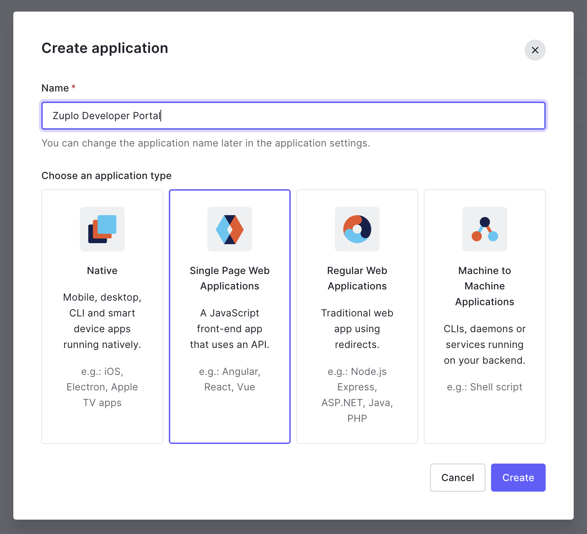
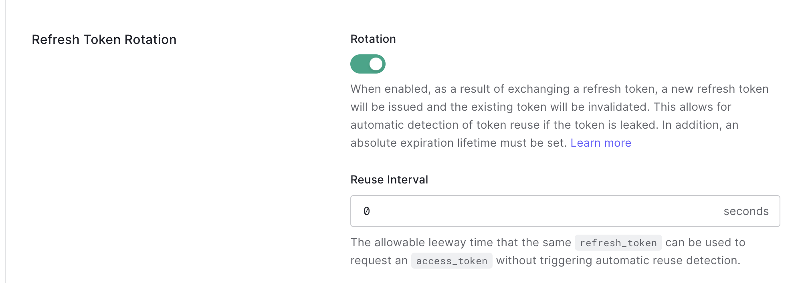
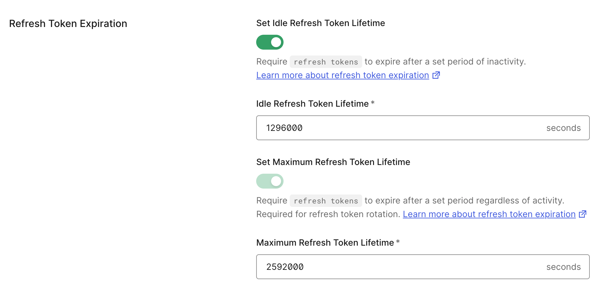
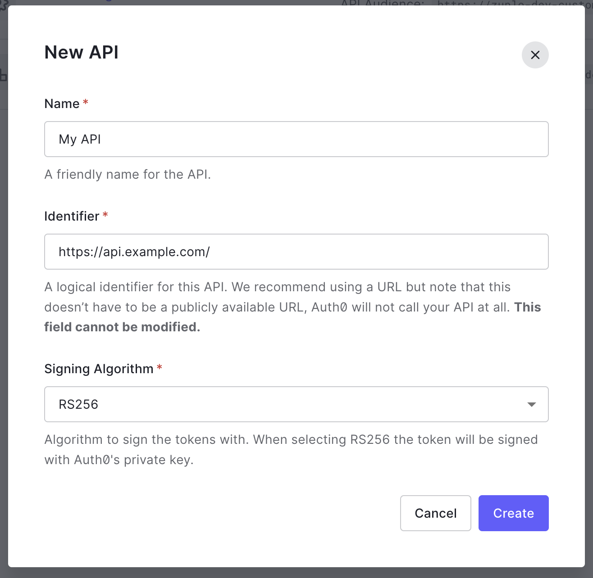

:::warning

This documentation is for the legacy version of the Dev Portal. If you are
looking for the new preview developer portal, please refer to the
[docs](/docs/dev-portal).

:::

## Auth0 Setup

If you don't have an Auth0 account, you can sign up for a
[free Auth0 account](https://auth0.com/signup) that will provide you will 7,000
monthly active users.

### 1/ Create Auth0 Application

[Create a new Auth0 application](https://auth0.com/docs/get-started/auth0-overview/create-applications)
in the Auth0 dashboard. When creating the application select type "Single Page
Web Applications"

### 2/ Configure Auth0 Application

You must set the following fields in the Auth0 application:

**Application URLs**

- **Allowed Callback URLs**: Add your docs site URL (for example
  `https://my-app.zuplo.app/docs/`). Note, you should include the trailing
  slash.
- **Allowed Logout URLs**: Add your docs site URL (for example
  `https://my-app.zuplo.app/docs/`). Not you should include the trailing slash.
- **Allowed Web Origins**: Add your docs site URL without the path (for example
  `https://my-app.zuplo.app`)

**Refresh Token Rotation**

- **Rotation**: Enabled
- **Reuse Interval**: Leave at `0`

**Refresh Token Expiration**

You can keep the defaults, which look like this:

If you have an older Auth0 app (options don't match the screenshot above) that
you're reusing, you'll want to set the following options:

- **Absolute Expiration**: Enabled
- **Absolute Lifetime**: Can be whatever time you want, default is `2592000`
- **Inactivity Expiration**: Enabled
- **Inactivity Lifetime**: Can be whatever you want, default is `1296000`

### 3/ Create an Auth0 API

[Create an API](https://auth0.com/docs/get-started/auth0-overview/set-up-apis)
in the Auth0 portal. Set the **Identifier** to something like
`https://api.my-domain.com/`. You will enter this value into Zuplo as the
**Audience** in the next step. Don't forget the trailing slash!

:::note

The identifier is commonly a URI, but it doesn't have to be, nor does the URI
have to match where your API is hosted. It's common practice to use the same
identifier for all different environments of your API even if they're on
different URLs.

:::

### 4/ Configure the Developer Portal

Inside of the Zuplo Developer portal navigate to the **Code Editor** tab and
open the `dev-portal.json` file. You can
[edit the JSON manually](./dev-portal-json.md), but in this tutorial we will use
the UI editor.

Set the following settings:

- **Enable Authentication**: Checked
- **Provider**: `auth0`
- **Issuer**: This is your Auth0 domain (for example `my-company.us.auth0.com`)
  in URL format like `https://my-company.us.auth0.com/`. You can find this in
  the "Basic Information" tab under your Single Page Application. _The trailing
  slash is required._
- **Client ID**: The client ID of the Auth0 Single Page Application that was
  created in the earlier steps. This is a string of letters an numbers. _The
  Client ID isn't a secret value._
- **Audience**: This is the value for `identifier` that you set when creating
  the Auth0 API in the previous step.

Once you save your changes, navigate to your developer portal and click "Sign
in".

## External Auth Setup

You can setup non-OIDC auth sources to work with the developer portal. See our
[Supabase Auth Guide](./dev-portal-supabase-auth.md) to learn how to configure
an external auth provider.
