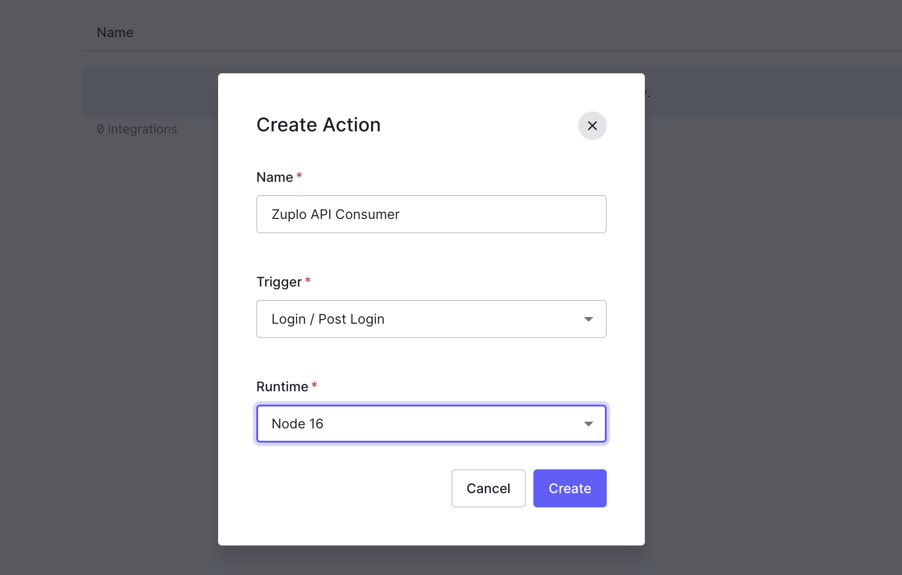
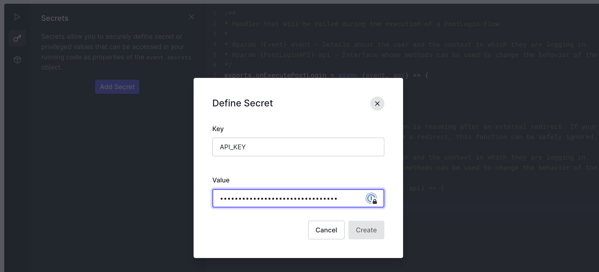
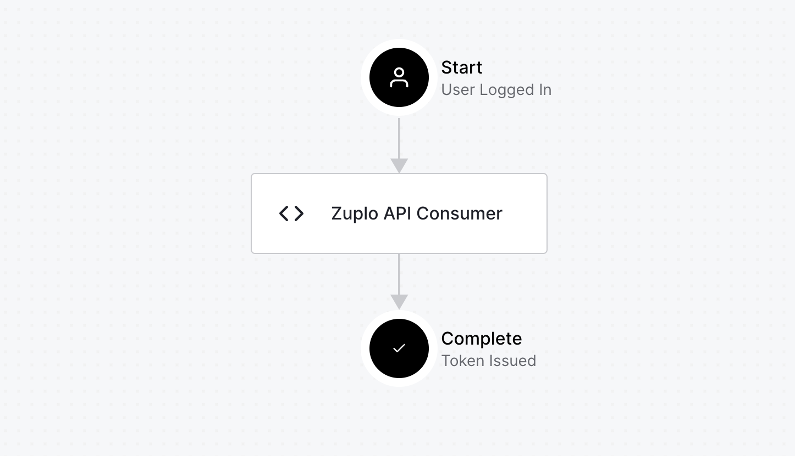

:::danger

This documentation is for the legacy version of the Dev Portal. If you are
looking for the new preview developer portal, please refer to the
[docs](/docs/dev-portal/introduction).

:::

By default, users who log into your Zuplo powered Developer Portal won't have an
API Consumer. This is by design as it allows you to control who has access to
your API, what their permissions or quotas are, etc. However, some APIs are open
to any user who can login. This might mean you let anyone login and create an
account or it might mean you use authorization policies with your identity
provider to control who can access the portal.

This article explains how to use Auth0 actions to automatically create an API
Key Consumer for your users when they sign into your developer portal.

:::tip

You don't need to set this up if using the built-in Zuplo monetization feature.
We do this all for you in that flow.

:::

Before you begin, you will need to
[setup custom authentication](./dev-portal-auth.md) for the developer portal -
you can't use the built-in "demo" provider for this tutorial.

To begin, open the [Auth0 management portal](https://manage.auth0.com) and
navigate to **Actions** > **Library**. Then click the button **Build Custom**.

Set a name for your custom action and select the **Login / Post Login** trigger.
Select Node.js version 16 or greater.



Next, add the Node module [`undici`](https://www.npmjs.com/package/undici) as a
package to the custom action. To open the module editor click the box icon on
the side bar, then click **Add Dependency** Enter the name `undici` and aa
specific version of the module, in this case `5.22.1`. Click **Create** when
finished.


In order to authenticate to Zuplo's Developer API, you will need to get your API
Key. See [this document](../../articles/developer-api.md) for instructions on
finding your API Key. Once you have retrieved your secret, click the key icon on
the Auth0 editor sidebar and click **Add Secret**. Name the secret `API_KEY` and
set the value.



:::info

In the code below set the variable `BUCKET_NAME` to the bucket being used by
your Zuplo Gateway. If you don't know the name of your bucket, you can
[list your buckets using the Developer API](https://dev.zuplo.com/docs/routes#apikeybucketsservice_list).

:::

Next, add the following code to your custom action. Be sure to replace the
placeholder values with your actual account and bucket names. Click the
**Deploy** button when you are finished.

```ts
const { fetch } = require("undici");
const { randomUUID } = require("crypto");

const ZUPLO_ACCOUNT = "my-zuplo-account";
const API_KEY_BUCKET = "my-bucket";

/**
 * Handler that will be called during the execution of a PostLogin flow.
 *
 * @param {Event} event - Details about the user and the context in which they are logging in.
 * @param {PostLoginAPI} api - Interface whose methods can be used to change the behavior of the login.
 */
exports.onExecutePostLogin = async (event, api) => {
  if (event.user.app_metadata.api_consumer) {
    console.log(
      `Skipping creating of API consumer. Already exists: ${event.user.app_metadata.api_consumer}`,
    );
    return;
  }

  const body = {
    description: `Consumer for ${event.user.name}`,
    managers: [event.user.email],
    metadata: {
      // Any metadata here
      user_id: event.user.user_id,
    },
    name: `c-${randomUUID()}`,
  };

  try {
    // Create the consumer
    const response = await fetch(
      `https://dev.zuplo.com/v1/accounts/${ZUPLO_ACCOUNT}/key-buckets/${API_KEY_BUCKET}/consumers?with-api-key=true`,
      {
        method: "POST",
        body: JSON.stringify(body),
        headers: {
          Authorization: `Bearer ${event.secrets.API_KEY}`,
          "content-type": "application/json",
        },
      },
    );
    const result = await response.json();
    if (response.status !== 200) {
      console.error(result);
      throw new Error("Error creating API consumer");
    }
    // Set the consumer in the user's metadata
    api.user.setAppMetadata("api_consumer", result.id);
  } catch (err) {
    // Catching error to not block the user's login to the portal
    console.error(err);
  }
};
```

Last, on the Auth0 side navigation bar, open **Actions** > **Flows**, then
select **Login**. Add the action to the workflow by selecting **Custom** and
dragging your custom action to the flow and then click **Apply**.



Now, login to your developer portal with a new user and you will see a consumer
has already been created.
