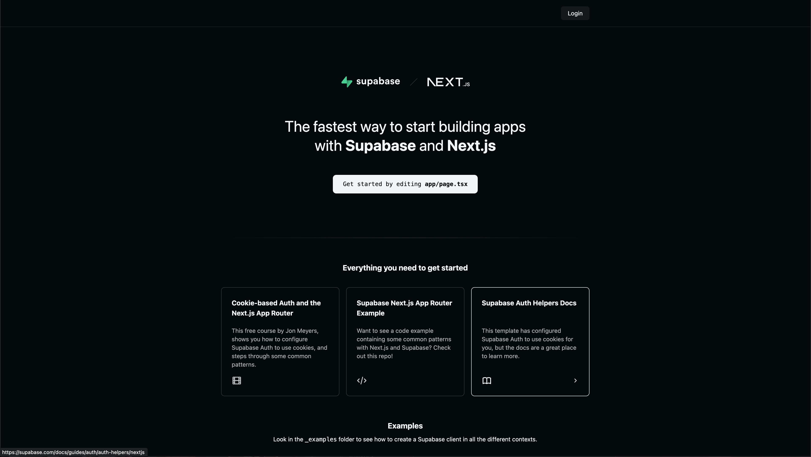

<LegacyDevPortal />

Do you want to share your API documentation and keys with your Supabase users?
Look no further! You can easily connect your existing Supabase authentication
with your Developer portal by following the guide below.

:::tip

Using Vercel and NextJS? You can skip all of the steps below by
[cloning our NextJS project](https://vercel.com/new/clone?repository-url=https%3A%2F%2Fgithub.com%2FAdrianMachado%2Fnextjs-with-supabase&env=ZUPLO_API_KEY,NEXT_PUBLIC_SUPABASE_URL,NEXT_PUBLIC_SUPABASE_ANON_KEY&envDescription=You%20can%20acquire%20your%20Supabase%20values%20from%20Supabase%20Dashboard%20%3E%20Project%20Settings%20%3E%20API.%20You%20can%20acquire%20your%20Zuplo%20key%20from%20Zuplo%20Portal%20%3E%20Project%20Settings%20%3E%20Zuplo%20API%20Keys&project-name=supabase-auth-app&repository-name=supabase-auth-app&demo-title=Supabase%20Auth%20Example&demo-description=The%20end-result%20of%20building%20your%20Supabase%20Auth%20App&demo-url=https%3A%2F%2Fnextjs-with-supabase-xi-seven.vercel.app%2Flogin&demo-image=https%3A%2F%2Fuser-images.githubusercontent.com%2F8291514%2F107029572-32f72d00-67ea-11eb-982e-e737f052eea1.png)!
Just fill in the `.env.local` file and you will be ready support Supabase Auth.

:::

## Pre-requisites

This guide assumes you already have the following:

- A Supabase project
- A basic understanding of Supabase Auth
  - You can [read their documentation](https://supabase.com/docs/guides/auth) to
    learn more
- Your Supabase anon key and project URL
  - You can find these under Project Settings > API
- “User signups” must be enabled on your project
  - You can find this under Project Settings > Auth

## 1/ Supabase Authentication App Setup

_This section will show you how to build an application to enable users to Sign
Up, Sign In, and Sign Out of your Supabase project. If you already have an
application that does this, you can skip to the next section._

The easiest way to get started with Supabase Auth is to use one of their
[Quickstart guides](https://supabase.com/docs/guides/auth/quickstarts/nextjs).
In this tutorial, we will be using their
[Next JS quickstart](https://supabase.com/docs/guides/auth/quickstarts/nextjs)
([repo](https://github.com/vercel/next.js/tree/canary/examples/with-supabase)).
Unfamiliar with Next JS? Try out the
[Next JS foundations course](https://nextjs.org/learn/foundations/about-nextjs).

Once your repo and environment variables are setup, you should see the following



Once you are ready, deploy your project to production.

## 2/ Configure Auth on Your Supabase Project

Grab the URL of your Vercel deployment and head over to the Supabase dashboard.
Navigate to Authentication > URL Configuration > Site URL and paste in the full
URL (ex. https://nextjs-with-supabase-xi-seven.vercel.app) in the Site URL
field.


## 3/ Configuring Your Developer Portal To Use Supabase Auth

From the Files view on your Zuplo project, navigate to the `dev-portal.json`
file under `Config`. This is the configuration view for your Zuplo Developer
Portal. Zuplo will automatically generate a developer portal from your OpenAPI
spec.

Change the Provider from `Demo` to `External`. You will see two new fields
appear: `Login URL` and `Logout URL`. These correspond to the `/login` and
`/auth/sign-out` endpoints on your Supabase Auth App. Fill in the URLs of these
endpoints (ex. `https://nextjs-with-supabase-xi-seven.vercel.app/login`). Your
developer portal will navigate to these pages to create and end sessions. Your
Authentication Settings should look like this once you are done:


Or in the JSON file:

```json
{
  "$schema": "https://cdn.zuplo.com/schemas/dev-portal.json",
  "enableAuthentication": true,
  "pageTitle": "Supabase Auth Test",
  "authentication": {
    "provider": "external",
    "loginUrl": "https://nextjs-with-supabase-xi-seven.vercel.app/login",
    "logoutUrl": "https://nextjs-with-supabase-xi-seven.vercel.app/auth/sign-out"
  },
  "generateExamples": true
}
```

## 4/ Grab Your Zuplo API key

Before we leave the Zuplo Portal, you’ll need to grab your Zuplo API key. This
key is used to securely connect your Supabase Auth App with the Developer
Portal. From the side nav, go to your Project Settings and then click **Zuplo
API Keys**. Copy your API key.


## 5/ Connecting Your Supabase Auth App to the Dev Portal

This section will explain how to integrate your Supabase Auth App and your
Developer Portal to support Email and Password authentication. You can view the
complete code in this
[sample repo](https://github.com/AdrianMachado/nextjs-with-supabase).

### Getting Started

The Developer Portal will navigate users to your `Login URL` with a special
query parameter called the `session-create-url` attached. This query parameter
is the endpoint your Supabase Auth App must call in order to create a session on
the Developer Portal.

### Sign Up Support

Follow the steps below to learn how to support users signing up for your
Supabase Project via the Developer Portal. You will be working on your Supabase
Auth App codebase from earlier.

1. Add the Zuplo API key you just copied to the `.env.local` file
   `ZUPLO_API_KEY=<your-key-here>`
2. Navigate to the file for your Login page(`app/login/page.tsx`)
3. In the props of your component, add
   `[searchParams](https://nextjs.org/docs/app/api-reference/file-conventions/page#searchparams-optional)`
   so you can read the `session-create-url` endpoint.

   ```tsx
   export default function Login({
     searchParams,
   }: {
     searchParams?: { [key: string]: string | string[] | undefined };
   });
   ```

4. Update your Sign Up button to forward the `session-create-url` to the sign-up
   endpoint

   ```tsx
   <button
     formAction={`/auth/sign-up${
       typeof searchParams?.["session-create-url"] === "string"
         ? `?session-create-url=${encodeURIComponent(
             searchParams["session-create-url"],
           )}`
         : ""
     }`}
     className="border border-gray-700 rounded px-4 py-2 text-black dark:text-white mb-2"
   >
     Sign Up
   </button>
   ```

5. Open your Sign Up route handler (`app/auth/sign-up`) and replace the
   `supabase.auth.signUp` call with the following

   ```ts
   const sessionCreateUrl = requestUrl.searchParams.get("session-create-url");
   const redirectUrl = new URL(`${requestUrl.origin}/auth/callback`);
   if (sessionCreateUrl) {
     // This will send the session-create-url as a query parameter to your
     // /auth/callback endpoint. We will use this in the next step
     redirectUrl.searchParams.set("session-create-url", sessionCreateUrl);
   }
   const { error } = await supabase.auth.signUp({
     email,
     password,
     options: {
       // The email confirmation link sent to the user will now redirect to
       // your /auth/callback endpoint
       emailRedirectTo: redirectUrl.toString(),
     },
   });
   ```

6. Open your Callback route handler (`app/auth/callback`) and replace the code
   with the following

   ```ts
   import { createRouteHandlerClient } from "@supabase/auth-helpers-nextjs";
   import { cookies } from "next/headers";
   import { NextResponse } from "next/server";

   export const dynamic = "force-dynamic";

   export async function GET(request: Request) {
     // The `/auth/callback` route is required for the server-side auth flow implemented
     // by the Auth Helpers package. It exchanges an auth code for the user's session.
     // https://supabase.com/docs/guides/auth/auth-helpers/nextjs#managing-sign-in-with-code-exchange
     const requestUrl = new URL(request.url);
     const code = requestUrl.searchParams.get("code");
     const sessionCreateUrl = requestUrl.searchParams.get("session-create-url");

     if (code) {
       const supabase = createRouteHandlerClient({ cookies });
       const sessionData = await supabase.auth.exchangeCodeForSession(code);
       // Read the user data from the code exchange response
       const { user } = sessionData?.data;
       if (!user) {
         return NextResponse.redirect(
           `${requestUrl.origin}/login?error=Could not authenticate user`,
           {
             status: 301,
           },
         );
       }

       // Call the sessionCreateUrl to create an auth session on the Dev Portal
       if (sessionCreateUrl) {
         // The sessionCreateUrl will already point to the correct environment
         // (ex. working copy, prod, staging), so no additional configuration
         // is needed.
         const ssoResponse = await fetch(sessionCreateUrl, {
           method: "POST",
           headers: {
             "content-type": "application/json",
             authorization: `Bearer ${process.env.ZUPLO_API_KEY}`,
           },
           body: JSON.stringify({
             email: user.email,
             name: user.user_metadata?.full_name,
             email_verified: user.confirmed_at != null,
             sub: user.id,
             picture: user.user_metadata?.avatar_url,
           }),
         });

         if (!ssoResponse.ok) {
           return NextResponse.redirect(
             `${requestUrl.origin}/login?error=Could not authenticate user`,
             {
               status: 301,
             },
           );
         }

         // The session creation response will contain a redirectURI that your user
         // must be redirected to in order to start their session
         const { redirectUri } = await ssoResponse.json();
         return NextResponse.redirect(redirectUri, {
           status: 301,
         });
       }
     }

     // If the sign up doesn't originate from the Dev Portal, redirect back to the
     // homepage
     return NextResponse.redirect(requestUrl.origin);
   }
   ```

7. Deploy your code (make sure to set an environment variable for you
   ZUPLO_API_KEY). Make sure the deployment URL matches the ones provided in
   your `dev-portal.json`.
8. Once deployed, navigate to your Dev Portal (you can find the link the header
   of the Developer Portal Settings) and click the “Sign In” button at the top
   right

   

9. You should be redirected to your Supabase Auth App. Enter the email and
   password and click “Sign Up”.
10. A email verification link will be sent to your email. Open the email and
    click the confirmation link

    

11. You will be redirected back to the Dev portal and be signed into your
    Supabase account!

### Sign in Support


Now that you have created your first user, follow the guide below to allow them
to sign into your Supabase project via the Developer Portal

1. Navigate to the file for your Login page(`app/login/page.tsx`)
2. Add a Sign In button after the password input field

   ```tsx
   <button className="bg-green-700 rounded px-4 py-2 text-white mb-2">
     Sign In
   </button>
   ```

3. On your `form` element, change the `action` to pass the `session-create-url`
   to the `/auth/sign-in` route handler.

   ```tsx
   <form
     className="flex-1 flex flex-col w-full justify-center gap-2 text-foreground"
     action={`/auth/sign-in${
       typeof searchParams?.["session-create-url"] === "string"
         ? `?session-create-url=${encodeURIComponent(
             searchParams["session-create-url"]
           )}`
         : ""
     }`}
     method="post"
   >
   ```

4. Open your Sign In route handler (`app/auth/sign-in`) and replace the code
   with the following

   ```ts
   import { createRouteHandlerClient } from "@supabase/auth-helpers-nextjs";
   import { cookies } from "next/headers";
   import { NextResponse } from "next/server";

   export const dynamic = "force-dynamic";

   export async function POST(request: Request) {
     const requestUrl = new URL(request.url);
     const formData = await request.formData();
     const email = String(formData.get("email"));
     const password = String(formData.get("password"));
     const supabase = createRouteHandlerClient({ cookies });

     // Read the user data from the sign-in response
     const { data, error } = await supabase.auth.signInWithPassword({
       email,
       password,
     });
     if (error) {
       return NextResponse.redirect(
         `${requestUrl.origin}/login?error=Could not authenticate user`,
         {
           // a 301 status is required to redirect from a POST to a GET route
           status: 301,
         },
       );
     }

     // Call the sessionCreateUrl to create an auth session on the Dev Portal
     const sessionCreateUrl = requestUrl.searchParams.get("session-create-url");
     if (sessionCreateUrl) {
       const user = data.user;
       // The sessionCreateUrl will already point to the correct environment
       // (ex. working copy, prod, staging), so no additional configuration
       // is needed.
       const ssoResponse = await fetch(sessionCreateUrl, {
         method: "POST",
         headers: {
           "content-type": "application/json",
           Authorization: `Bearer ${process.env.ZUPLO_API_KEY}`,
         },
         body: JSON.stringify({
           email: user.email,
           name: user.user_metadata?.full_name,
           email_verified: user.confirmed_at != null,
           sub: user.id,
           picture: user.user_metadata?.avatar_url,
         }),
       });

       if (!ssoResponse.ok) {
         return NextResponse.redirect(
           `${requestUrl.origin}/login?error=Could not authenticate user`,
           {
             status: 301,
           },
         );
       }

       // The session creation response will contain a redirectURI that your user
       // must be redirected to in order to start their session
       const { redirectUri } = await ssoResponse.json();
       return NextResponse.redirect(redirectUri, {
         status: 301,
       });
     }

     // If the login doesn't originate from the Dev Portal, redirect back to the
     // homepage
     return NextResponse.redirect(requestUrl.origin, {
       status: 301,
     });
   }
   ```

5. Deploy your code (make sure to set an environment variable for you
   ZUPLO_API_KEY) and navigate to your Dev Portal. Then click the **Sign In**
   button
6. You should be redirected to your Supabase Auth App. Enter the email and
   password of an existing user and click **Sign In**.
7. You will be redirected back to the Dev portal and be signed into your
   Supabase account!

### Sign Out Support

You successfully created a user and signed up. Follow the guide below to learn
how to sign them out.

1. Navigate to your Sign Out route handler (`app/auth/sign-out`) and add the
   following function

   ```ts
   export async function GET(request: Request) {
     const requestUrl = new URL(request.url);
     // The Developer Portal will send a `redirect_uri` query parameter to this
     // route. This is the URL that the user should be redirected to after signing
     // out.
     const redirectUri = requestUrl.searchParams.get("redirect_uri");
     const supabase = createRouteHandlerClient({ cookies });

     await supabase.auth.signOut();

     return NextResponse.redirect(redirectUri ?? `${requestUrl.origin}/login`, {
       status: 301,
     });
   }
   ```

2. Deploy your code and navigate to your Dev Portal. Sign in if you aren’t
   already. Then click your user icon and **Logout**

3. You should now be signed out of your Supabase Account

### (Optional) Additional Auth Provider Support via Supabase


Supabase allows you to connect
[many different Auth Providers](https://supabase.com/docs/guides/auth/social-login).
Follow the steps below to enable your users to sign up via Github. **Note: You
need to have completed the Sign Up Support section above first**

1. Follow
   [this Supabase guide](https://supabase.com/docs/guides/auth/social-login/auth-github)
   to configure your project to support GitHub Auth
2. Create a new file called `GithubLogin.tsx` in your `app/login` directory and
   paste in the following code

   ```ts
   "use client";

   import { createClientComponentClient } from "@supabase/auth-helpers-nextjs";

   const GithubLogin = ({
     sessionCreateUrl,
   }: {
     sessionCreateUrl: string | string[] | undefined;
   }) => {
     return (
       <button
         type="button"
         onClick={async () => {
           const supabase = createClientComponentClient();
           await supabase.auth.signInWithOAuth({
             provider: "github",
             options: {
               redirectTo:
                 typeof sessionCreateUrl === "string"
                   ? `${
                       window.location.origin
                     }/auth/callback?session-create-url=${encodeURIComponent(
                       sessionCreateUrl
                     )}`
                   : undefined,
               queryParams:
                 // This will allow your /auth/callback route to receive the
                 // session-create-url query param and redirect the user to the
                 // dev portal after signing in.
                 typeof sessionCreateUrl === "string"
                   ? {
                       sessionCreateUrl: encodeURIComponent(sessionCreateUrl),
                     }
                   : undefined,
             },
           });
         }}
         className="border border-purple-700 rounded px-4 py-2 text-black dark:text-white mb-2"
       >
         Github
       </button>
     );
   };

   export default GithubLogin;
   ```

3. In your Login Page (`app/login/page.tsx`), add the following code above the
   Sign Up button

   ```tsx
   <GithubLogin sessionCreateUrl={searchParams?.["session-create-url"]} />
   ```

   You should now see a GitHub button on your login page

4. Deploy your code and navigate to your Dev Portal. Then click the **Sign In**
   button
5. You should be redirected to your Supabase Auth App. Click the **GitHub**
   button
6. You will be redirected to the GitHub OAuth flow. Sign into GitHub if you
   aren’t already, and navigate through the flow
7. You will be redirected back to the Dev portal and be signed into your GitHub
   account!

## Wrap Up & Next Steps

You can now use Supabase Auth to login to your Zuplo Developer Portal. Here’s
some steps to try next:

- Elevate your API and Developer Portal experience with a custom domain to match
  your Supabase Auth App.
  [Get started with our Builder plan today](https://zuplo.com/pricing)!
- Want to get more out of your Developer Portal? You can setup
  [API Key Authentication](../../articles/step-3-add-api-key-auth.mdx) to allow
  your new users to manage their keys in the Developer Portal directly!
