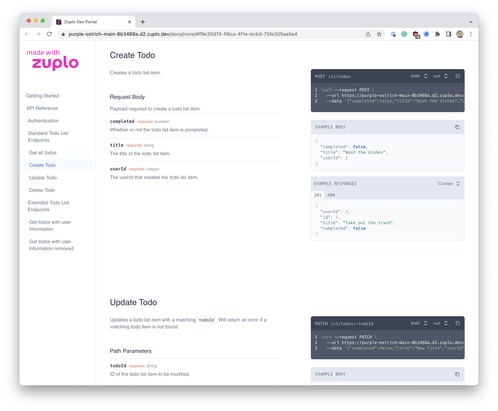

:::danger

This documentation is for the legacy version of the Dev Portal. If you are
looking for the new preview developer portal, please refer to the
[docs](/docs/dev-portal/introduction).

:::

Every Zuplo project automatically includes a full featured developer portal that
renders your OpenAPI specification as a beautiful page complete with examples,
schemas, and more. You don't need to do anything to enable your developer portal
except for create routes in your API project. However, you are free to customize
the look and feel as well as enhance the site by adding descriptions, examples,
and schemas to your Open API specification - the more you add the more complete
your developer portal will be and the better experience your customers will have
learning and using your API.

## Next Steps

Your developer portal will work out of the box without any special
configuration, however before you share your portal with customers, partners,
etc. you should ensure you have completed the following steps.

1. **[Familiarize yourself with the file structure](./dev-portal-setup.md)** -
   There are several files that are used to configure your developer portal. It
   is good to have an understanding these files before you start customizing
   your portal.

1. **[Setup or Disable Authentication](./dev-portal-auth.md)** - by default your
   developer portal is configured with a "demo" Auth0 account. This allows you
   to test authentication and create API Keys without extra configuration. If
   you are configuring a custom domain for you API project and developer portal,
   you **must** use your own authentication configuration.

1. **[Set your logo, favicon, and title](./dev-portal-json.md)** - You'll want
   to configure your developer portal with your own branding.

1. **[Enhance your Open API Spec](./dev-portal-configuration.md)** - In addition
   to routes, adding descriptions, examples, and schemas will make your API much
   easier to use.

1. **[Add custom documentation](./dev-portal-adding-pages.md)** - Often you will
   want to add additional instructions to your API docs.

1. **[Configure a Custom Domain](./custom-domains.md)** - If you are on one of
   our paid plans, you will want to host your gateway on something like
   `api.example.com` so that your customers can access your docs at
   `https://api.example.com/docs`.

1. **[Create Consumers on Login](./dev-portal-create-consumer-on-auth.md)** -
   Use Auth0 actions to automatically create consumers when they login to your
   developer portal.
