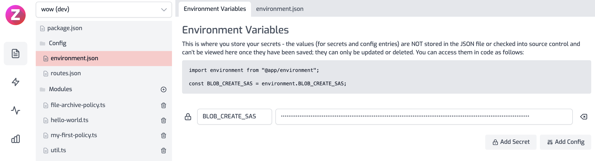

<!-- WARNING: This document is generated. DO NOT EDIT BY HAND -->

# Archive Response to Azure Storage

<CustomPolicyNotice name="Archive Response to Azure Storage" id="archive-response-azure-storage-outbound" />


<!-- start: intro.md -->
In this example shows how you can archive the body of outgoing responses to
Azure Blob Storage. This can be useful for auditing, logging, or archival
scenarios.

<!-- end: intro.md -->

<PolicyStatus isBeta={false} isPaidAddOn={false} />


## Example Custom Policy

The code below is an example of how this custom policy module could be implemented.

```ts title="modules/archive-response-azure-storage-outbound.ts"
import { HttpProblems, ZuploContext, ZuploRequest } from "@zuplo/runtime";

interface PolicyOptions {
  blobContainerPath: string;
  blobCreateSas: string;
}

export default async function (
  response: Response,
  request: ZuploRequest,
  context: ZuploContext,
  options: PolicyOptions,
) {
  // NOTE: policy options should be validated, but to keep the sample short,
  // we are skipping that here.

  // because we will read the body, we need to
  // create a clone of this response first, otherwise
  // there may be two attempts to read the body
  // causing a runtime error
  const clone = response.clone();

  // In this example we assume the body could be text, but you could also
  // response the blob() to handle binary data types like images.
  //
  // This example loads the entire body into memory. This is fine for
  // small payloads, but if you have a large payload you should instead
  // save the body via streaming.
  const body = await clone.text();

  // let's generate a unique blob name based on the date and requestId
  const blobName = `${Date.now()}-${context.requestId}.req.txt`;

  const url = `${options.blobContainerPath}/${blobName}?${options.blobCreateSas}`;

  const result = await fetch(url, {
    method: "PUT",
    body: body,
    headers: {
      "x-ms-blob-type": "BlockBlob",
    },
  });

  if (result.status > 201) {
    const text = await result.text();
    context.log.error("Error saving file to storage", text);
    return HttpProblems.internalServerError(request, context, {
      detail: text,
    });
  }

  // Continue the response
  return response;
}

```

## Configuration 

The example below shows how to configure a custom code policy in the 'policies.json' document that utilizes the above example policy code.

```json title="config/policies.json"
{
  "name": "my-archive-response-azure-storage-outbound-policy",
  "policyType": "archive-response-azure-storage-outbound",
  "handler": {
    "export": "default",
    "module": "$import(./modules/YOUR_MODULE)",
    "options": {
      "blobCreateSas": "$env(BLOB_CREATE_SAS)",
      "blobContainerPath": "$env(BLOB_CONTAINER_PATH)"
    }
  }
}
```

<div className="policy-options">
<div><h3 class="anchor anchorWithStickyNavbar_node_modules-@docusaurus-theme-classic-lib-theme-Heading-styles-module" id="policy-configuration">Policy Configuration<a href="#policy-configuration" class="hash-link" aria-label="Direct link to Policy Configuration" title="Direct link to Policy Configuration">​</a></h3><ul><li><code>name</code> <span class="type-option">&lt;string&gt;</span> - The name of your policy instance. This is used as a reference in your routes.</li><li><code>policyType</code> <span class="type-option">&lt;string&gt;</span> - The identifier of the policy. This is used by the Zuplo UI. Value should be <code>archive-response-azure-storage-outbound</code>.</li><li><code>handler.export</code> <span class="type-option">&lt;string&gt;</span> - The name of the exported type. Value should be <code>default</code>.</li><li><code>handler.module</code> <span class="type-option">&lt;string&gt;</span> - The module containing the policy. Value should be <code>$import(./modules/YOUR_MODULE)</code>.</li><li><code>handler.options</code> <span class="type-option">&lt;object&gt;</span> - The options for this policy. <a href="#policy-options">See Policy Options</a> below.</li></ul><h3 class="anchor anchorWithStickyNavbar_node_modules-@docusaurus-theme-classic-lib-theme-Heading-styles-module" id="policy-options">Policy Options<a href="#policy-options" class="hash-link" aria-label="Direct link to Policy Options" title="Direct link to Policy Options">​</a></h3><p>The options for this policy are specified below. All properties are optional unless specifically marked as required.</p><ul><li><code>blobCreateSas</code><span class="type-option"> &lt;string&gt;</span> - <div><p>The Azure shared access token with permission to write to the bucket</p></div></li><li><code>blobContainerPath</code><span class="type-option"> &lt;string&gt;</span> - <div><p>The path to the Azure blob container</p></div></li></ul></div>
</div>

## Using the Policy
<!-- start: doc.md -->
## Using the Policy

In order to use this policy, you'll need to setup Azure storage. You'll find
instructions on how to do that below.

### Setup Azure

First, let's set up Azure. You'll need a container in Azure storage
([docs](https://docs.microsoft.com/en-us/azure/storage/common/storage-account-create?tabs=azure-portal)).
Once you have your container you'll need the URL - you can get it on the
`properties` tab of your container as shown below.

> **Note** - this sample is available as a Zup It on GitHub - just click ZupIt!
> to deploy to your Zuplo account:
> https://github.com/zuplo/samples-req-archive-filestorage


This URL will be the `blobPath` in our policy options.

Next, we'll need a SAS (Shared Access Secret) to authenticate with Azure. You
can generate one of these on the `Shared access tokens` tab.

Note, you should minimize the permissions - and select only the `Create`
permission. Choose a sensible start and expiration time for your token. Note, we
do not recommend restricting IP addresses because Zuplo runs at the edge in over
200 data-centers world-wide.


Then generate your SAS token - copy the token (not the URL) to the clipboard and
enter it into a new environment variable in your zup called `BLOB_CREATE_SAS`.
You'll need another environment variable called `BLOB_CONTAINER_PATH`.



<!-- end: doc.md -->

Read more about [how policies work](/docs/articles/policies)
