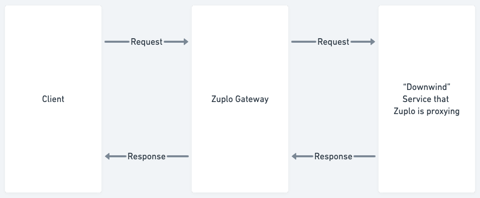

We often want to read the body of a request or response before forwarding it on
to the downwind service or back to the client respectively.



When we do this inside the Zuplo gateway in a
[Request Handler](../handlers/custom-handler.mdx) we've to be careful to clone
the request or response to avoid causing a `body-used` exception.

A `body-used` exception occurs when a `.body` property of a request or response,
which is of type `ReadableStream`, has already been read. These properties can
only be read once and if we pass that same object to `fetch` (for the downwind
call) or return it from a request handler - you’ll get that exception.

> Note - you can check to see if a body has already been used by looking at the
> `.bodyUsed` property of `ZuploRequest` and `Response`.

## How to clone the request and response

Let’s imagine we want to log both the request body and response body of a
proxied call to a downwind service

```ts
export default async async function(req: ZuploRequest, ctx: ZuploContext) {
	// pretend we want to log the request and response body
	const reqClone = req.clone();
  const reqBody = await reqClone.text();
	ctx.log.debug(reqBody);

	// we can now safely re-use this body to call the downstream
	// service
	const response = await fetch('https://downwind-url.com/foo/bar', {
		method: req.method,
		body: req.body;
	});

	const resClone = response.clone();
	const resBody = await resClone.text();
	req.logger.debug(resBody);

	// we can now safely use the original response
	return response;
}
```

If you don’t need to read the body - we recommend against cloning the request or
response as it will make your gateway more memory efficient and increase
performance.

> Note - in [policies](../policies), if you need to read the body we always
> recommend using `.clone()` first, as you don’t know what the end request
> handler might want to do with the originals.
