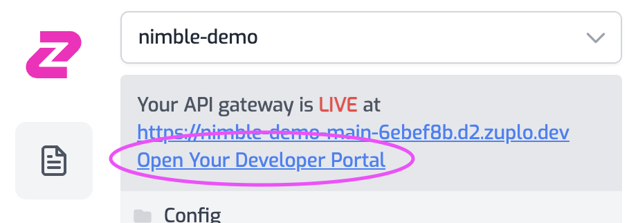

Zuplo is an API gateway that helps any business offer a stripe quality experience to customers using their API. We previously posted about the [three pillars of an API program](https://zuplo.com/blog/2022/05/11/the-three-pillars-of-an-API-program/), and believe great **documentation** is a critical part of sharing an API.

You can quickly setup a gateway for your API in Zuplo, which includes a developer portal, example shown below:

Follow this guide to have a developer portal up and running in minutes.

:::note

**How is this different to RapiDoc?**

[RapiDoc](https://rapidocweb.com/) is an open-source library you can use to self-host developer documentation based on Open API/Swagger. Zuplo is a sponsor of that project and uses code from RapiDoc's open source library to create our documentation. Zuplo offers a hosted developer portal experience that goes further and includes a fully featured gateway that can offer API-Key management, Rate-limiting and much more.
:::

## Overview

Zuplo uses a `routes.json` file to configure all the routes in the gateway, including any policies applied (like validation and authentication policies) and also stores the metadata that drives the content of the developer portal.

Sign in to Zuplo and get your free developer account at [portal.zuplo.com](https://zuplo.link/3Q2Sd2I) and follow these simple steps to see the developer portal in action.

## Step 1 - Create a new Zuplo Project

Once you've signed into the portal you'll be prompted to create a new project. Enter a name and click create - in a matter of seconds you'll be able to edit the configuration of your new gateway (and developer portal).

## Step 2 - Create some routes

:::tip

You can also import an Open API specification to setup your gateway and `routes.json` quickly. This feature is in private-beta - e-mail us at [whatzup@zuplo.com](mailto:whatzup@zuplo.com) to request access.

:::

Your project will open on the **Route Designer** which helps you edit the `routes.json` file. Let's add some routes, so that there is something to see in your developer portal. I recommend adding 2 routes:

### Route 1

- Method: `GET`
- Path: `/products/:productId`
- URL Rewrite: `https://ecommerce-api.zuplo.io/products/${params.productId}`

### Route 2

- Method: `POST`
- Path: `/products`
- URL Rewrite: `https://ecommerce-api.zuplo.io/products`

## Step 3 - Customize your documentation

You can already check out your developer portal. The link is at the top left of the portal, example shown below

You'll see lots of placeholder text "Lorem ipsum" for your documentation. You can update this by editing the `routes.json` file and saving your changes. The developer portal will update automatically and always be in-sync with your gateway.

## Step 4 - Add JSON Schema validation to specify a request body

Zuplo can automatically validate the body of incoming JSON requests using JSON Schema. We provide an example schema (at `schemas/example-schema.json`). To add this to your second route open the **Policies** section and click **Add Policy** to the request pipeline. Choose the JSON Body Validation schema and click OK (this defaults to use the example schema).

Click save and check your developer portal again - note that now the second operation now specifies details about the body and even gives an example in code.

## What next?

If you haven't already, why not try the [Getting Started guide](https://zuplo.com/docs/overview/) and setup a gateway with Rate-Limiting and API-Key authentication. It's easy!
