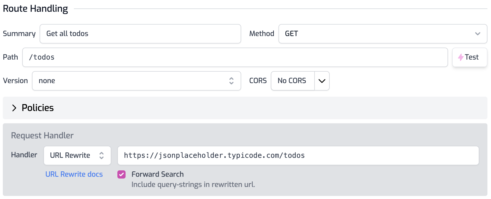

# Dynamic Rate Limiting

Our overall [API Gateway Quickstart](./proxy-public-api.md) shows how to configure basic [rate limiting](../policies/rate-limit-inbound.md) for a route. A default rate limit policy is a great way to protect your API, but sometimes you need more control. For example, what if you have different types of customers with different rate expectations? Maybe your premium customers want 100,000 calls / minute, but you only allow free customers 100 calls / minute. In this quickstart, you will learn how to set a custom rate limit policy for a single customer based on a route parameter.

Before we start, create a new project in [portal.zuplo.com](https://portal.zuplo.com)

In this quickstart we'll assume you authentication in place and have some metadata available that tells you what their rate limits should be. In this example, we'll assume you are using [API Key Authentication](../quickstarts/add-api-key-auth.md) and have a property on your consumer's metadata that indicates their `plan` as one of free `free`, `pro` or `enterprise`. You could also use a JWT token that contains a similar claim, or [call a database to look up data about a customer](../examples/per-user-rate-limits-using-db).

## 1/ Setup Route

Open the **routes.json** file and add a new route. Set the **version** to `v1` and the **path** of the new route to
`/todos`.

Set the **Handler** drop-down to **URL Rewrite** and set the value to `https://jsonplaceholder.typicode.com/todos`. This will proxy a simple, demo todo api.



## 2/ Add Policy

Open your `routes.json` file and find the "What zup?" route. Expand **Policies** and click **Add Policy**. Type "rate" to filter the list and select **Rate Limiting**.


Enter the following configuration as shown in the screenshot.

```json
{
  "export": "BasicRateLimitInboundPolicy",
  "module": "$import(@zuplo/runtime)",
  "options": {
    "requestsAllowed": 2,
    "timeWindowMinutes": 1,
    "rateLimitBy": "function",
    "identifier": {
      "module": "$import(./modules/rate-limiter)",
      "export": "rateLimitKey"
    }
  }
}
```

Click **OK**, then **Save** to save the `routes.json` file.

## 3/ Rate Limiter Function

Create a new empty module called `rate-limiter.ts` by clicking the **+** icon next to the **Modules** folder. Add the following code to your module.

```ts
import {
  CustomRateLimitPolicyOptions,
  ZuploContext,
  ZuploRequest,
} from "@zuplo/runtime";

// A simple dictionary of account type <=> rate-limits per minute
const requestsAllowedByAccountType = {
  free: 100,
  pro: 10000,
  premium: 1000000,
};

export function rateLimitKey(
  request: ZuploRequest,
  context: ZuploContext,
  policyName: string
): CustomRateLimitPolicyOptions {
  // Let's read the `accountType` property from the API Key Consumer's
  // metadata. Note the rate-limit policy must be behind the api-key
  // policy in the request pipeline to ensure that the request.user object
  // is hydrated
  const accountType = request.user.data.accountType;
  const requestsAllowed = requestsAllowedByAccountType[accountType];

  return {
    key: request.user.sub, // key by user sub
    requestsAllowed: requestsAllowed,
    timeWindowMinutes: 1,
  };
}
```

**Related Docs**

- [Rate Limit Policy](../policies/rate-limit-inbound.md)
- [API Gateway Quickstart](../quickstarts/proxy-public-api.md)

**Next Steps**

- [Add API Key Auth to an API](../quickstarts/add-api-key-auth.md)
