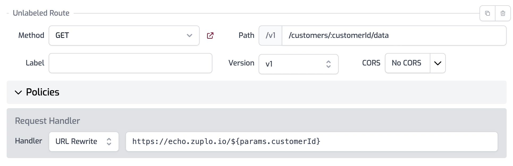

The [API Gateway Quickstart](./proxy-public-api.md) quick start shows how to configure [rate limiting](../policies/rate-limit-inbound.md) for a route. A default rate limit policy is a great way to protect your API, but sometimes you need more control. In this quickstart, you will learn how to set a custom rate limit policy for a single customer based on a route parameter.

## 1/ Setup Route

Open the **routes.json** file and add a new route. Set the **version** to be `v1` and the **path** of the new route to be
`/customers/:customerId/data`.

Set the **Handler** drop down to **URL Rewrite** and set the value to `https://echo.zuplo.io/${params.customerId}`. This will proxy the echo API with a simple response with our `customerId`



## 2/ Add Policy

Open your `routes.json` file and find the "What zup?" route. Expand **Policies** and click **Add Policy**. Type "rate" to filter the list and select **Rate Limiting**.


Enter the following configuration as shown in the screenshot.

```json
{
  "export": "BasicRateLimitInboundPolicy",
  "module": "$import(@zuplo/runtime)",
  "options": {
    "requestsAllowed": 2,
    "timeWindowMinutes": 1,
    "rateLimitBy": "function",
    "identifier": {
      "module": "$import(./modules/rate-limiter)",
      "export": "rateLimitKey"
    }
  }
}
```

Click **OK**, then **Save** to save the `routes.json` file.

## 3/ Rate Limiter Function

Create a new empty module called `rate-limiter.ts` by clicking the **+** icon next to the **Modules** folder. Add the following code to your module.

```ts
import { CustomRateLimitPolicyOptions, ZuploRequest } from "@zuplo/runtime";

export function rateLimitKey(
  request: ZuploRequest
): CustomRateLimitPolicyOptions {
  if (request.params.customerId === "100") {
    // Override timeWindowMinutes & requestsAllowed
    return {
      key: request.params.customerId,
      requestsAllowed: 100,
      timeWindowMinutes: 1,
    };
  }
  return { key: request.params.customerId };
}
```

## 4/ Test

Open the **API Test Console** by clicking the lightning bolt icon. Create a new test called `rate-limit.json`. Set the **Method** to `GET` and change the **Path** to `/v1/customers/abc/data`.

Click the **Test** button 3 times quickly and you will see the error _Rate limit exceeded, please try again later_.

Change the path to `/v1/customers/100/data` and try running the test again. You will notice that the rate limit wont be triggered - unless you really want to click 100 times ;).

## Congratulations, you setup dynamic rate limiting

**Related Docs**

- [Rate Limit Policy](/docs/policies/rate-limit-inbound)
- [API Gateway Quickstart](/docs/quickstarts/proxy-public-api.md)

**Next Steps**

- [Add API Key Auth to an API](/docs/quickstarts/add-api-key-auth.md)
