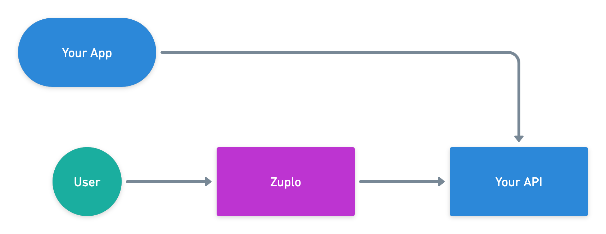
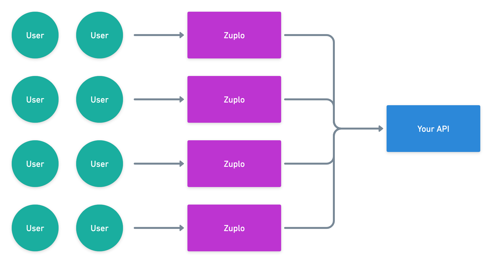

# What is Zuplo?

Zuplo is an API Management platform designed for developers. Developers love Zuplo because it:

1. **Is Programmable** - code your own handlers and policies in typescript.
2. **Uses Gitops** - integrates with GitHub and deploys via gitops (like Vercel and Netlify).
3. **Respects your toolset** - use Visual Studio, Sublime, whatever IDE you like, or our [web portal](https://portal.zuplo.com/signup).
4. **Offers infinite scale at the edge** - scales effortlessly to billions of requests, deploy to the edge at over 200 locations around the world with 0ms startup time.

We think Zuplo is the easiest way for developers to share their APIs. Zuplo provides a host of services that allow you to add authentication, observability, and control to your API so that you can safely share it with customers, partners, and other developers.

Zuplo includes:

- Highly customizable API Gateway
- API Key Authentication
- API Key Management and API Key Secret Scanning
- A beautiful Developer Portal for your user's to manage their Keys
- Automatic API Documentation (import your OpenAPI spec if you have one)
- Rate limiting and other policies to enforce access compliance
- Integrations with other services, like Auth0
- And much more

Zuplo handles more than 1.5 billion API requests per month, here’s what some of our users have to say: 

> ***"Overall, working with Zuplo is much easier than battling with Envoy filters. Excellent work and keep it rolling!"***
> 
- Yuhui Shi, ConvectAI

> ***“We gave Zuplo a try, we were live within a couple of hours, and it's been almost zero maintenance since. It's saved us time and energy that we can now direct to adding even more value for our customers."***
> 
- Luke Kim, Spice AI

# How does Zuplo Work?
Zuplo sits in front of your API to provide security, authentication, caching, rate limiting, and more. If you want to use Zuplo to manage access and use for all callers (internal, partners, customers, etc.) you can put Zuplo in front of all API calls and use Zuplo as a full API Gateway.

Alternatively, you can adopt Zuplo as a partial gateway. In this case, you might want to keep your existing access methods, such as your internal apps calling your API, while using Zuplo to control how your customers or partners use your API.

### Performance

Zuplo runs on hundreds of data centers worldwide that are close to your users, so your users will see extremely low latency connection times. Zuplo runs on fast and reliable network infrastructure, which often means adding Zuplo in front of your API will decrease the response time for your existing API.

### Scale

Zuplo builds on servers that run in large data centers and massive-scale edge locations. Our infrastructure offers unlimited scale for handling millions or billions of requests with ease.

Zuplo can help you scale your existing API to new levels by adding caching and other policies that can dramatically reduce the traffic that actually reaches your endpoints.

