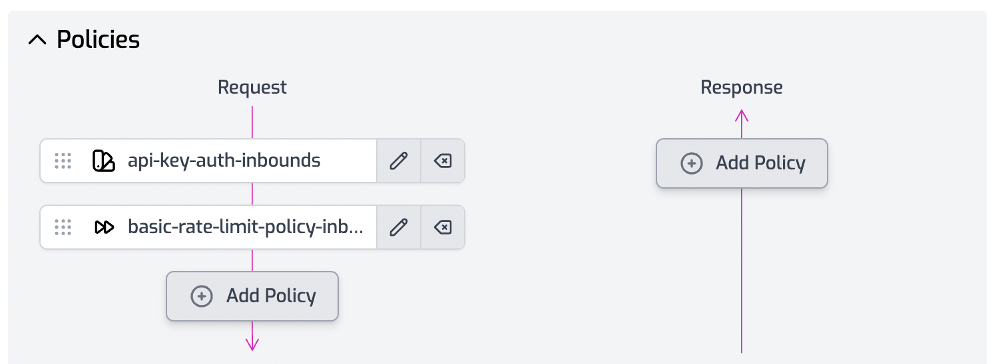
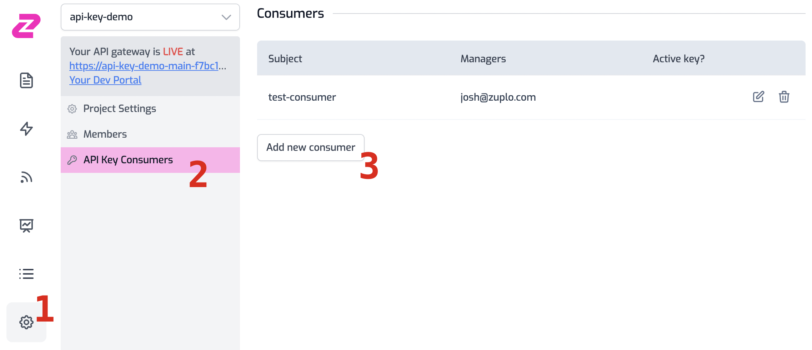

# Getting Started - a great API experience for your customers in minutes

Our goal is to help you offer an excellent experience to developers consuming your API, while protecting things you care about.

There's a few minimum ingredients to successfully sharing an API:

- Authentication ([we recommend API keys](https://zuplo.com/blog/2022/05/03/you-should-be-using-api-keys))
- Protection (rate-limiting, because your customers will accidentally try to take you down)
- Documentation (peeps gotta learn how to user your API)

In this getting started guide we'll show you just how easy it is to set up all these things for an example API at [`https://ecommerce-api.zuplo.io`](https://ecommerce-api.zuplo.io).

You can [open this getting started guide in another window](https://zuplo.com/docs/overview), if that helps.

## 1. Setup your first route

Open the routes.json file in the file editor on the left. Change the first route's **path** to `/products/:productId` and the **URL Rewrite** to `https://ecommerce-api.zuplo.io/products/${params.productId}`.

You now have a route on your gateway that matches an incoming request like `/products/10000` and forwards it to `https://ecommerce-api.zuplo.io/products/10000`.

## 2. Add authentication and protection

Next, we’ll add two policies to this route:

- API-Key Authentication
- Rate-limiting

Click the **Add Policy** button on the request pipeline and add each of these policies.

## 3. Setup an API Consumer

Now that your API is protected with API-Key authentication you need to create an API consumer that can generate a key. Head to the  **Settings** section and choose **API Key Consumers**.

Click Add new consumer [3] and enter a name for your API key, and enter your own e-mail address as the manager (so that you can create a key to complete the demo), then click Save - you can leave the metadata blank.

## 4. Visit your developer portal to create a key

Click on the **Your Dev Portal** link near the top left of the portal.

You’ll see the documentation that has been automatically generated for your API 🎉. Click the sign-in button at the top right and sign in with your e-mail address. Click the API Key tab - you should see the name of the key you set up in step 3. Click Create key to generate your API key and copy it to your clipboard... you’re ready to go.

## Now test your API 🚀

Open the integrated  **API Test Console** [1] and set the path to `/products/10000` [2]. Hit **Test** [3] to fire an unauthenticated request to your API - you should get a **401 Unauthorized** response.

Now add an `authorization` header with the format `Bearer <apikey>` [4], using the API key you copied from the developer portal - you should get a **200** 🎊 .

Finally, hit **Test** [3] a few more times to test that rate limiting ✋.
