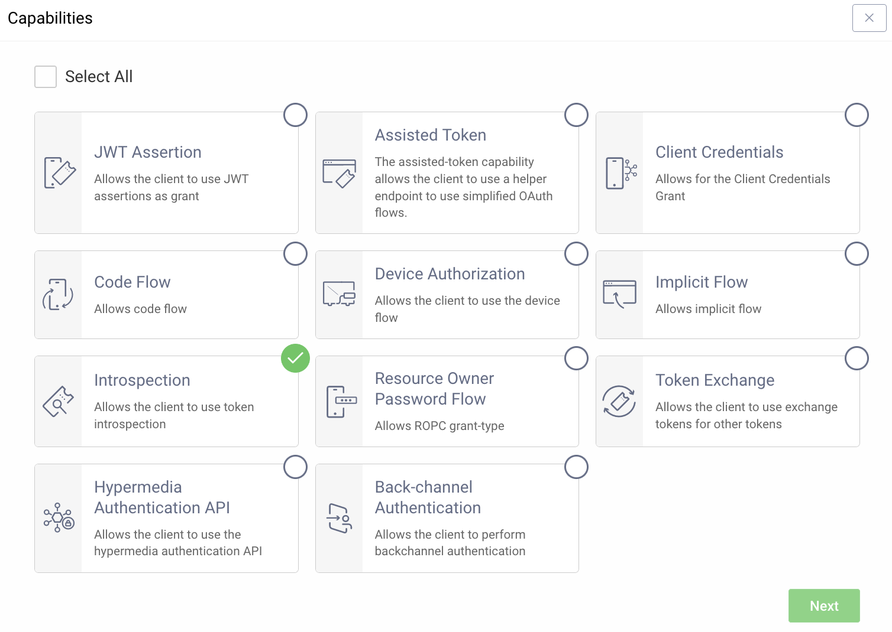
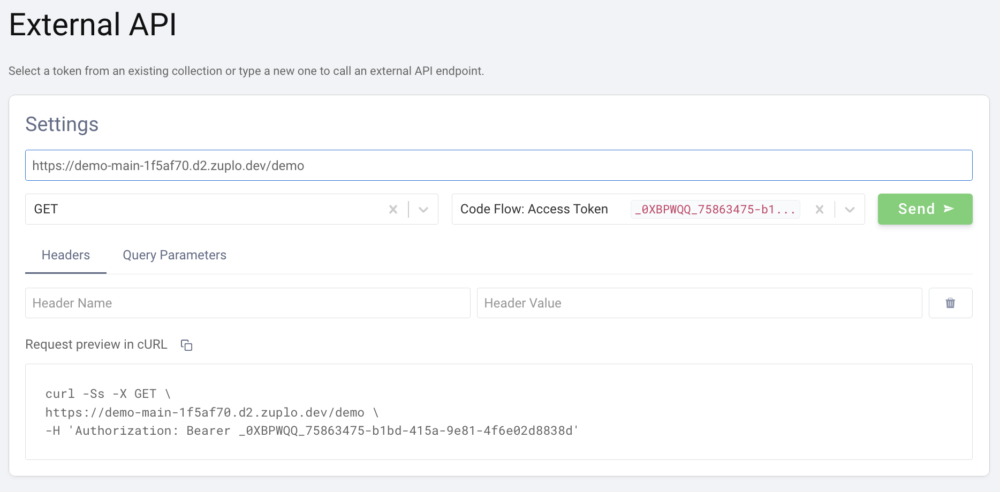

## Using the Policy

Adding the Curity Phantom Token Pattern to your route is trivial. Before 
getting started, make sure that you have an instance of the [Curity Identity 
Server](https://curity.io/) up and running.

### Setup the Curity Identity Server

Getting the Curity Identity Server up and running is quick. Follow the 
[Getting Started Guide ](https://curity.io/resources/getting-started/) to 
install and configure the server.

#### Introspection
In addition to the instructions outlined in the Getting Started Guide a client 
that enable introspection is needed. Typical recommendation for this is to create 
a new separate client that only enables the introspection capability.



#### Exposing the runtime
Depending on where the Curity Identity Server is deployed you might have to 
expose the runtime node using a reverse proxy. One option is to use 
[ngrok](https://curity.io/resources/learn/expose-local-curity-ngrok/) but 
other solutions could also be used. 

#### OAuth Tools
With the server up and running and available you can use [OAuth Tools](https://oauth.tools/) to test 
the configuration and make sure that you are able to obtain a token. I an opaque token is possible to
obtain you are good to continue.

### Set Environment Variables
Before adding the policy, there are a few environment variables that will need
to be set that will be used in the Curity Phantom Token Policy.

1. In the [Zuplo Portal](https://portal.zuplo.com) open the **Environment
   Variables** section in the <SettingsTabIcon /> **Settings** tab.

2. Click **Add new Variable** and enter the name `INTROSPECTION_URL` in the name
   field. Set the value to URL endpoint of the Curity Identity Server that handles introspection. Ex. 
   `https://idsvr.example.com/oauth/v2/oauth-introspect`

3. Click **Add new Variable** again and enter the name `CLIENT_ID` in the
   name field. Set the value to ID of the client that you added the introspection capability to.

4. Click **Add new Variable** again and enter the name `CLIENT_SECRET` in the
   name field. Set the value to the secret of the client that you added the introspection capability to.
   **Make sure to enable `is Secret?`.**
   

### Create the module
In the [Zuplo Portal](https://portal.zuplo.com) open the **Route Designer**
   in the <CodeEditorTabIcon /> **Files** tab then click `+` next to **Modules**, choose **Empty Module** to add a new module. 
   Name the module `curity-phantom-token.ts`. Next paste the below code into the editor.

```js
// curity-phantom-token.ts
import { ZuploRequest, ZuploContext, environment } from "@zuplo/runtime";

export default async function (
  request: ZuploRequest,
  context: ZuploContext) {
  const authHeader = request.headers.get("Authorization");

  if (!authHeader) {
    return new Response(`No Authorization header`, { status: 401 });
  }

  var token = getToken(authHeader);

  if (!token) {
    return new Response(`Failed to parse token from Authorization header`, { status: 401 });
  }

  function getJwt(): Promise<string> {
    return (fetch(environment.INTROSPECTION_URL, {
      headers: {
        'Authorization': 'Basic ' + btoa(`${environment.CLIENT_ID}:${environment.CLIENT_SECRET}`),
        'Accept': 'application/jwt',
        'Content-Type': 'application/x-www-form-urlencoded'
      },
      method: 'POST',
      body: 'token=' + token + '&token_type_hint=access_token',
    }).then(function (response) {
      return response.text();
    }))
    //TODO: Catch introspection error
  };

  context.waitUntil(getJwt());

  var jwt = await (getJwt());

  if (!jwt) {
    return new Response(`Introspection failed`, { status: 401 });
  }

  request.headers.set('Authorization', jwt)

  return request;
}

function getToken(authHeader) {
  if (authHeader.split(" ")[0] === "Bearer") {
    return authHeader.split(" ")[1];
  }
  return null;
}
```

### Add the Curity Phantom Token Policy

The next step is to add the Curity Phantom Token Auth policy to a route in your project.

1. In the [Zuplo Portal](https://portal.zuplo.com) open the **Route Designer**
   in the <CodeEditorTabIcon /> **Files** tab then click **routes.oas.json**.

2. Select or create a route that you want to authenticate with the Curity Phantom Token Pattern. Expand the
   **Policies** section and click **Add Policy**. Search for and select the **Custom Code Inbound** policy.

3. In the configuration editor, paste the following to overwrite the existing configuration:

```json
{
  "export": "default",
  "module": "$import(./modules/curity-phantom-token)",
  "options": {
    "allowUnauthenticatedRequests": false
  }
}
```
 
4. Click **OK** to save the policy.

5. Click **Save All** to save all the configurations.

### Test the Policy

Head over to OAuth Tools to test the policy.

1. Run a flow to obtain an opaque token (typically Code Flow)

2. Configure an **External API** flow and add your Zuplo endpoint in the **API Endpoint** 
  field. Set the request method and choose the opaque token obtained in step 1. 



3. Click **Send**. The panel on the right should now display the response from the API. 
  If the upstream API echos back what is sent you will see that the `Authorization` header now
  contains a JWT instead of the original opaque token that was sent in the request.

### Conclusion
You have now setup the Curity Phantom Token Pattern for Authentication. Your API Gateway now accepts 
an opaque access token in the Authorization header and will handle obtaining a corresponding signed JWT
that will be passed on to the upstream API.