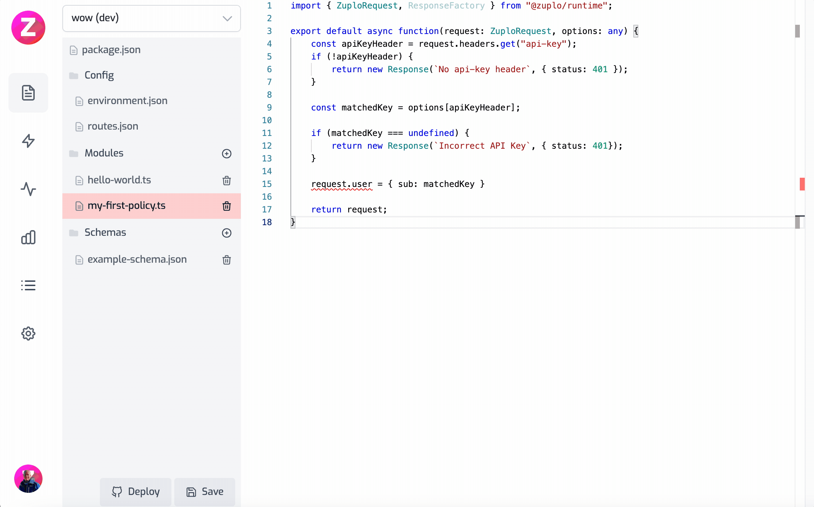

## Writing A Policy

Custom policies can be written to extend the functionality of your gateway. This
document is about inbound policies that can intercept the request and, if
required, modify it before passing down the chain.

Policies have a similar but subtly different signature to a
[request handler](/docs/handlers/custom-handler.mdx).

They also accept a `ZuploRequest` parameter but they must return either a
`ZuploRequest` or a `Response`.

:::tip

Note that both `ZuploRequest` and `Response` are based on the web standards
[Request](https://developer.mozilla.org/en-US/docs/Web/API/request) and
[Response](https://developer.mozilla.org/en-US/docs/Web/API/Response).
ZuploRequest adds a few additional properties for convenience, like `user` and
`params`.

:::

Returning a `ZuploRequest` is a signal to continue the request pipeline and what
you return will be passed to the next policy, and finally the request handler.

If you return a `Response` that tells Zuplo to short-circuit this request and
immediately respond to the client.

```ts
export type InboundPolicyHandler<TOptions = any> = (
  request: ZuploRequest,
  context: ZuploContext,
  options: TOptions,
  policyName: string,
) => Promise<ZuploRequest | Response>;
```

A common use case for policies is authentication. In the following example we'll
create a simple auth policy that checks for an `api-key` header:

## A simple auth policy

```ts
// my-first-policy.ts
import { ZuploRequest } from "@zuplo/runtime";

export default async function(
	request: ZuploRequest,
	context: ZuploContext
	options: any,
	policyName: string) {
  	const apiKeyHeader = request.headers.get("api-key");
	if (!apiKeyHeader) {
		return new Response(`No api-key header`, { status: 401});
	}
	if (apiKeyHeader !== `magic-password`) {
		return new Response(`Incorrect API Key`, { status: 401});
	}
	// TODO - lets set the user property on the request for
	// downstream consumption
	return request;
}
```

This policy checks for an `api-key` header and rejects requests that don't have
one. If such a header is found, it then checks the content of the header for a
magic password. This example shouldn't be used in a real API but is
demonstrative of how you might build custom authentication.

## Wiring up the policy on routes

Policies are activated by specifying them on routes in the route.oas.json file.
Here's how we could wire up our new auth route:

```json
// /config/policies.json
{
  "policies": [
    {
      "name": "my-first-policy",
      "policyType": "custom-code-inbound",
      "handler": {
        "export": "default",
        "module": "$import(./modules/my-first-policy)"
      }
    }
  ]
}
```

```json
// /config/routes.oas.json
{
  ...
  "paths": {
  "/redirect-test": {
    "x-zuplo-path": {
      "pathMode": "open-api"
    },
    "get": {
      "summary": "Testing rewrite handler",
      "x-zuplo-route": {
        "corsPolicy": "none",
        "handler": {
          "module": "$import(@zuplo/runtime)",
          "export": "redirectHandler",
          "options": {
            "location": "/docs"
          }
        }
      },
      "policies": {
        "inbound": ["my-first-policy"]
      }
    }
  }
}

}
```

## Policy Options

In your policy configuration, you can specify additional information to
configure your policy on the options property. In the example below we set an
example object with some properties of type string and number. Note these
objects can be as complicated as you like.

```json
{
  "name": "my-first-policy",
  "policyType": "custom-code-inbound",
  "handler": {
    "export": "default",
    "module": "$import(./modules/my-first-policy)",
    "options": {
      "you": "can",
      "specify": "anything",
      "here": 0
    }
  }
}
```

The value of this property will be passed to your policy's handler as the
`options` parameter. Sometimes it's useful to create a type as shown below.

```ts
type MyPolicyOptionsType = {
  you: string;
  specify: string;
  here: number;
};
export default async function (
  request: ZuploRequest,
  context: ZuploContext,
  options: MyPolicyOptionsType,
  policyName: string,
) {
  // your policy code goes here, and can use the options to perform any
  // configuration
  context.log.info(options.you);
}
```

You can also use the `any` type if you prefer not to create a type.

## Setting the user property

When building a policy it's common to modify the request object in some way
before passing control downstream. The `ZuploRequest` type has a `user` property
that isn't set for unauthenticated requests. Authenticated requests should have
a valid `user` property. Since this is an authentication policy, we should set
that property before passing control to the next in line.

The user object should have a `sub` property which is a unique user id. Let's
use Zuplo's policy `options` to extend our example.

You can pass options to a policy from the policies.json file. In this case,
we'll create a dictionary of API keys to `sub` ids.

```json
"policies": [
    {
      "name": "my-first-policy",
      "policyType": "custom-code-inbound",
      "handler": {
        "export": "default",
        "module": "$import(./modules/my-first-policy)",
				// some options that will be passed to our Policy
				"options": {
					"123" : "sub-1",
					"abc" : "sub-2"
				}
      }
    }
  ]
```

Now let's update the policy to read these options and use the dictionary keys as
the `api-key` and to map the sub identifier.

```ts
import { ZuploRequest, ZuploContext } from "@zuplo/runtime";

export default async function (
  request: ZuploRequest,
  context: ZuploContext,
  options: any,
  policyName: string,
) {
  const apiKeyHeader = request.headers.get("api-key");
  if (!apiKeyHeader) {
    return new Response(`No api-key header`, { status: 401 });
  }

  const matchedKey = options[apiKeyHeader];

  if (matchedKey === undefined) {
    return new Response(`Incorrect API Key`, { status: 401 });
  }

  request.user = { sub: matchedKey };

  return request;
}
```

We can then use this user object in the request handler

```ts
import { ZuploRequest } from "@zuplo/runtime";

export default async function (request: ZuploRequest) {
  // let's return the user sub to the client as proof it's working
  return `User sub ${request.user.sub}`;
}
```

Here is this example working as a gif



## Modifying the request headers

Sometimes we need to modify the request more significantly, and this will
require creating a new request object. In this case, let's imagine we want to
convert incoming parameters to headers.

```ts
export default async function (request: ZuploRequest) {
  // create a new request based on the old one,
  // this is required because the original request's
  // headers are immutable
  const newRequest = new ZuploRequest(request);
  // enumerate over the params object and copy to the new
  // request
  Object.keys(request.params).forEach((param) => {
    newRequest.headers.set(param, request.params[param]);
  });

  return newRequest;
}
```

For a more complex example, check out the
[custom logging implementation](/docs/articles/custom-logging-example.mdx).
